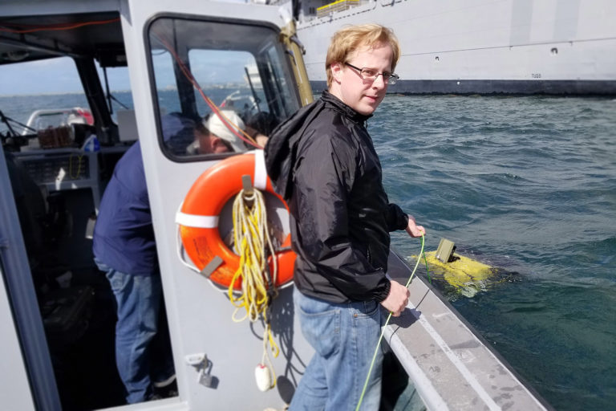
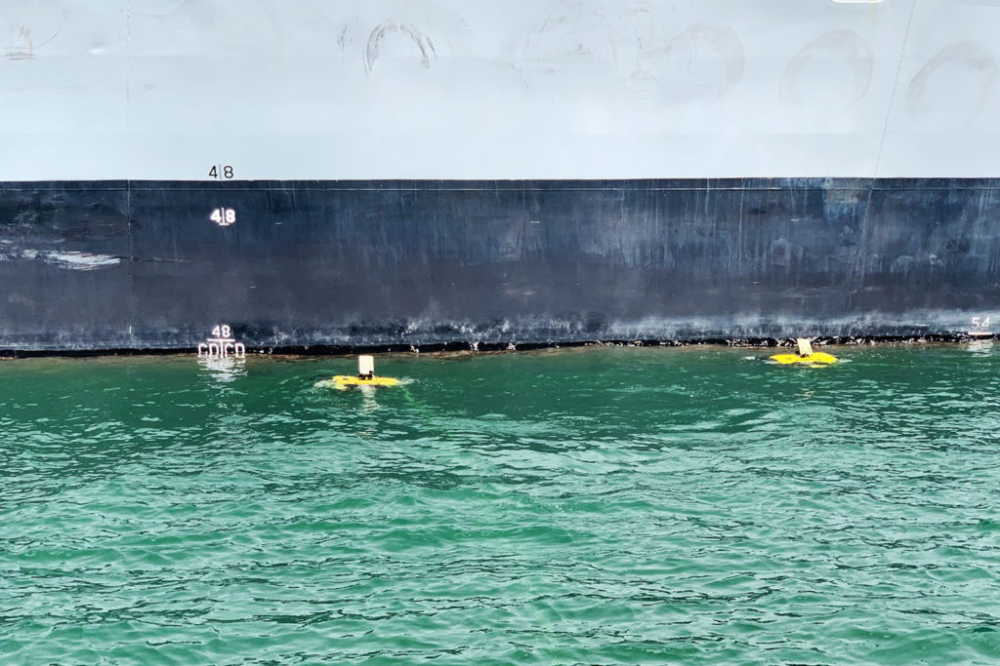

<figure>

<figcaption>

An underwater autonomous robot built to inspect dams, bridges, and hulls of ships practices by inspecting the side of a pool. Courtesy of Joshua Mangelson.  

</figcaption>

</figure>

In a Navy shipyard in San Diego, a new generation of underwater robots are learning to communicate and collaborate in order to inspect boats, bridges, pipelines, and other underwater structures. Developed by Joshua Mangelson, a University of Michigan doctoral student in Robotics, the autonomous vehicles overcome the many challenges posed by murky water by simplifying how the robots coordinate and communicate.

Water, while the basis of life for many, means death for wireless communication. “Below a meter or two of water, Wi-Fi cuts out completely,” Mangelson said. “Same with GPS signals. This is because water attenuates electromagnetic signals very quickly, which makes underwater exploration and mapping a very interesting problem.”

<!--more-->

Instead of the wireless communications used above the sea, underwater wireless communications rely on either light or acoustic transmissions. Light-based underwater communication is still early in research, but can require clear line-of-sight between vehicles in often-cloudy water.

<figure>

<figcaption>

Joshua Mangelson, Robotics PhD student, launches an autonomous underwater inspection vehicle. Courtesy of Joshua Mangelson.  

</figcaption>

</figure>

“Using sound and acoustics only allows communication of bits per second, however,” Mangelson said. “A previous labmate likened underwater communication to sending one tweet per minute–and that is a tweet with just characters, no photo.”

During an underwater inspection, the team of robots need to let one another know where they are headed and where they have been. If the robots had the communication bandwidth available from Wi-Fi or location data from GPS, they could determine location and orient themselves using common objects captured by sensors or even send exact coordinates. But, communicating such heavy data is currently impossible.

With this lack of bandwidth of underwater communications, Mangelson needed to simplify and condense what the robots said to each other.

“As the robots move through the underwater environment, they measure the bathymetry, or depth of the seafloor, and how it changes,” Mangelson explained. “Using our optimization framework, the robots can use the bathymetry data to align their trajectories.” Only able to whisper in acoustic pings, the robots send and receive this sparse depth data and, utilizing Mangelson’s solution, can use it to work together in mapping and inspecting underwater objects.

Important to Mangelson’s solution is that it does not rely on any initial location data, such as GPS coordinates. This is because the approach is based on convex optimization, which unlike other types of optimization, does not require an initial estimate of the solution to find the optimal solution. Mangelson designed the problem so that there are no other possible answers that the algorithm might confuse for its universal solution, which also makes his approach more robust.

The paper that outlines the work, “[Communication Constrained Trajectory Alignment for Multi-Agent Inspection via Linear Programming](http://robots.engin.umich.edu/~joshuagm/pubs/jmangelson-2018b.pdf),” won first place in the student poster competition at the IEEE OES/MTS [OCEANS](https://www.oceansconference.org/) Conference.

<figure>

<figcaption>

These robots work in tandem to inspect the hull of a ship. Courtesy of Joshua Mangelson.

</figcaption>

</figure>

Also authors on the paper are Ram Vasudevan, Assistant Professor of Mechanical Engineering, and Ryan Eustice, Associate Professor of Naval Architecture and Marine Engineering. Both are also Core Faculty of the Robotics Institute.

Mangelson continues to test and advance this research in experiments with the Navy in San Diego and Coast Guard in Boston, which allows him to encounter real world problems with the technology.

“During field trial experiments, you have to deal with the real environment, such as hardware leaking, in addition to developing your algorithms, so the algorithms end up more closely tied to reality. That’s one of the reasons I’m interested in field robotics, because you get to sit right on the boundary of the gap between theory and application.”

Mangelson hopes to expand the number of robots sailing in his fleet, and eventually enable quick, automated inspections of important vessels and infrastructure.

The research was supported by the Office of Naval Research under award N00014-16-1-2102.
