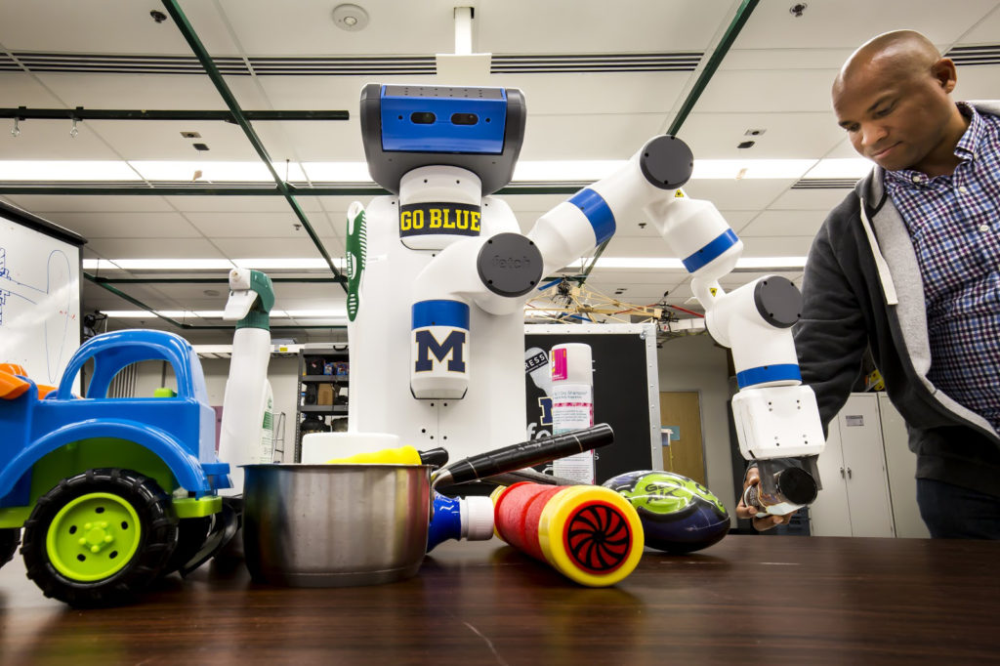
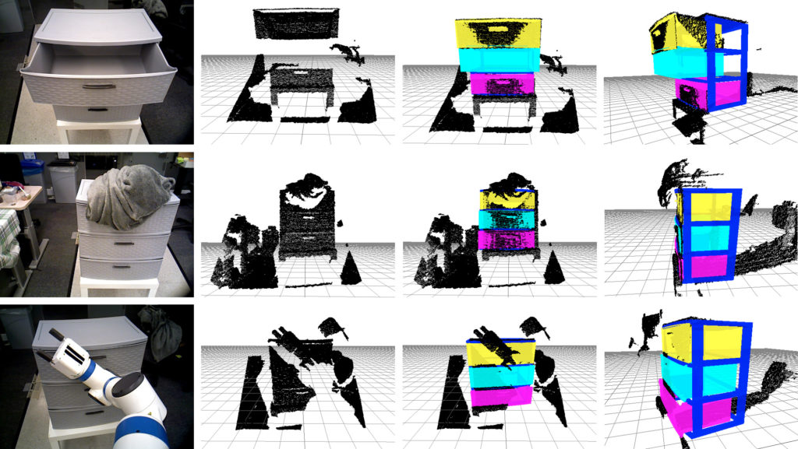
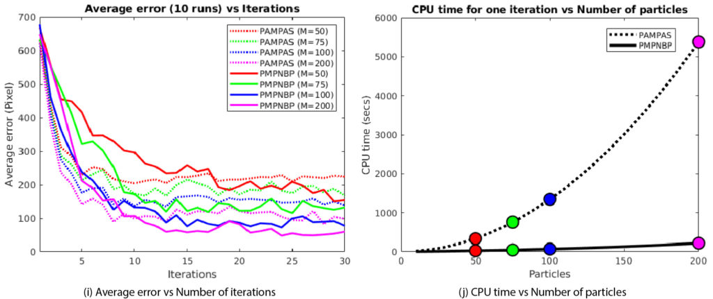

<figure>

<figcaption>

Chad Jenkins, seen here with a Fetch robot, leads the Laboratory for Progress, which aims to discover methods for computational reasoning and perception that will enable robots to effectively assist people in common human environments. Karthik Desingh, lead author on the paper, is a member of the lab. Photo: Joseph Xu/Michigan Engineering

</figcaption>

</figure>

In a step toward home-helper robots that can quickly navigate unpredictable and disordered spaces, University of Michigan researchers have developed an algorithm that lets machines perceive their environments orders of magnitude faster than similar previous approaches.

<!--more-->

“Robot perception is one of the biggest bottlenecks in providing capable assistive robots that can be deployed into people’s homes,” said Karthik Desingh, a graduate student in computer science and engineering and lead author of a paper on the work [published](https://robotics.sciencemag.org/content/4/30/eaaw4523) in Science Robotics.

“In industrial settings, where there is structure, robots can complete tasks like build cars very quickly. But we live in unstructured environments, and we want robots to be able to deal with our clutter.”

Historically, robots operate most effectively in structured environments, behind guard rails or cages to keep humans safe and the robot’s workspace clean and orderly. However, a human’s environment, at work or home, is typically a jumble of objects in various states: papers across a keyboard, a bag hiding car keys, or an apron hiding half-open cupboards.

The U-M researchers’ approach is designed to help robots move from the structured environments of factories and labs into the chaotic and complex domains of humans.

The team’s new algorithm, called Pull Message Passing for Nonparametric Belief Propagation (PMPNBP), can compute an accurate understanding of an object’s pose—or position and orientation—orders of magnitude faster than previous methods.

The team has demonstrated how their algorithm and a Fetch robot can correctly perceive and use a set of drawers, even when half-covered with a blanket, when a drawer is half-open, or when the robot’s arm itself is hiding a full sensor view of the drawers. The team has also demonstrated how the algorithm can scale beyond a simple dresser to an object with multiple complicated joints, in this case through accurately perceiving the pose of the robot’s own body and gripper arm.

The paper outlining their work is titled “Efficient Nonparametric Belief Propagation for Pose Estimation and Manipulation of Articulated Objects.” Desingh researches in the Laboratory for Progress, which is led by paper co-author Chad Jenkins, who is a core faculty member at Michigan’s Robotics Institute and a professor of computer science and engineering.

“The concepts behind our algorithm, such as Nonparametric Belief Propagation, are already used in computer vision and perform very well in capturing the uncertainties of our world,” Jenkins said, “but these models have had limited impact in robotics as they are very expensive computationally, requiring more time than practical for an interactive robot to help in everyday tasks.”

The Nonparametric Belief Propagation (NBP) technique along with the similar Particle Message Passing (PAMPAS) technique were first published in 2003. The field of computer vision, which attempts to gain a thorough understanding of a scene through images and video, can better utilize these algorithms than the field of robotics can. That’s because two-dimensional images or video requires less computational power and time than the three-dimensional scenes involved in robot perception.

But no matter the number of dimensions, earlier works understand a scene by translating it into a graph model of nodes and edges, which represent each component of an object and their relationships between one another.

The algorithms then hypothesize—or create beliefs of—component locations and orientations when given a set of constraints. These beliefs, which the researchers call particles, vary across a range of probabilities. To narrow down the most likely locations and orientations, the components utilize push messaging to send probable location information across nodes and back. That location information is then compared with sensor data. This process takes several iterations to ultimately arrive at an accurate belief of a scene.

<figure>

<figcaption>

The first two columns show observations of the same scene, the first as a typical 2D image, the second as a 3D point cloud, or a map of the distance to multiple points. The last two columns are estimates of the pose, or position and orientation, computed by the team’s new algorithm from two different perspectives. Image courtesy paper authors.  

</figcaption>

</figure>

For example, given a dresser with three drawers, each component of the object—in this case each drawer and the dresser itself—is a node that informs the others on their probable location while considering inherent constraints. A few such constraints would be that the drawers must be within the dresser, and the drawers move laterally but not vertically. The information, passed among the nodes, is compared with real observations from sensors, such as a 2D image and 3D point cloud. The messages are repeated through iterations until there is an agreement between the beliefs and sensor data.

This is computationally intensive, which means it requires a lot of processing time and power. To simplify the demands on computing, Desingh and the Michigan team utilized what is called “pull messaging.” The approach turns the cacophony of back-and-forth, information-dense messages into a concise conversation on only the most necessary pieces of information between an object’s components.

In this example, instead of the dresser sending location information to a drawer only after computing information from the other drawers, the dresser checks with the drawers first. It asks each drawer for its own belief of its location, then, for accuracy, weights that belief against information from the other drawers. It converges on a accurate understanding of a scene through iterations just as the push approach.

<figure>

<figcaption>

The average error of the proposed PMPNBP method developed by the Michigan team is on par with previous methods, such as PAMPAS, while the computation time is exponentially less. These results are from tests on a two-dimensional pattern. Image courtesy paper authors.

</figcaption>

</figure>

To directly compare their new approach with previous approaches, they tested it on a simple 2D scene of a circle with four rectangular arms hidden among a pattern of similar circles and rectangles. The new approach could do in 10 minutes what took today’s techniques more than an hour and a half.

Specifically, the previous approaches required over 20 minutes of processing time per iteration to pass messages, while the team’s new method took fewer than two minutes, and as the number of beliefs or particles increased, this improvement becomes exponentially faster. In these trials, it took five iterations with their new algorithm to achieve less than a 3.5-inch average error in location estimate of the drawers and dresser, or less than 8-inch average error in location estimate when the dresser is partly obscured by a blanket. This is on par with previous approaches, and varies depending on an object’s size, numbers of parts, and how much is visible to sensors. Most important, the accuracy increases enough for successful manipulation of objects by a robot through continuing iterations.

“This is just the start of what we can do with belief propagation in robot perception,” Desingh said. “We want to scale our work up to multiple objects and tracking them during action execution, and even if the robot is not currently looking at an object. Then, the robot can use this ability to continually observe the world for goal-oriented manipulation, and successfully complete tasks.”

Additional authors on the paper include Shiyang Lu, Robotics, and Anthony Opipari, Computer Science and Engineering.

The research was supported by NSF award IIS-1638047.
