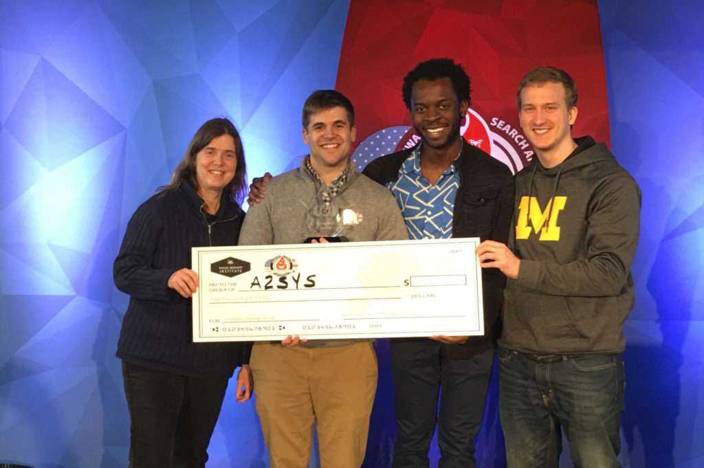
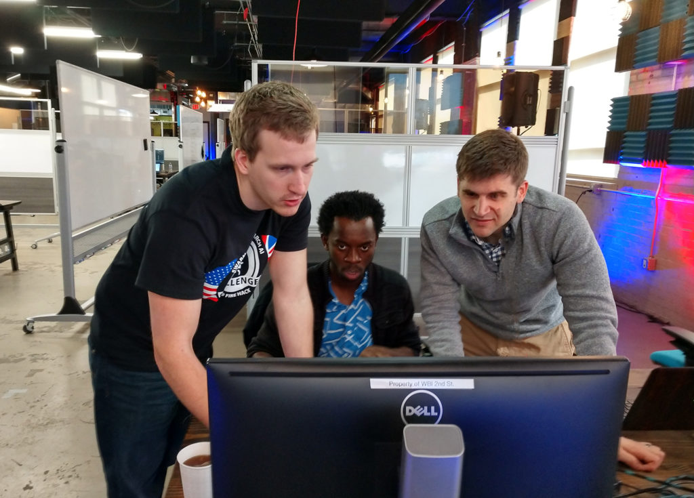

<figure>

<figcaption>

Ella Atkins, Jeremy Castagno, Prince Kuevor, and Matthew Romano won the 2019 Swarm & Search AI Challenge held in Dayton, Ohio over March 29-31, 2019. Photo courtesy A2Sys Lab.

</figcaption>

</figure>

Last year, California experienced the single largest wildfire in its recorded history, a wildfire in Greece killed 100, and wildfires in the British Columbia surpassed the historic proportions seen only the year before. Water and firebreaks can fight immediate threats, but improved mapping and better planning in deploying such resources can maximize impact and minimize risk, reducing the impact of fires over an entire season.  

One way to improve mapping and firefighting plans? Unmanned aerial vehicles (UAVs) and algorithms that allow them to operate autonomously.

<!--more-->

To speed innovation and utilize swarms of firefighting UAVs, the Wright Brothers Institute (WBI) hosted the [2019 Swarm & Search AI Challenge: Firehack](https://www.wbi-innovates.com/single-post/2019/03/19/2019-Swarm-Search-AI-Challenge-Fire-Hack---PRESS-KIT), a pilot project sponsored by the Air Force Research Laboratory (AFRL) and U.K. Defense Science and Technology Laboratory (DSTL).

https://www.youtube.com/watch?v=XNF\_Sddlgy4

The competition brought teams from around the U.S. and the U.K. to develop code that was able to control UAVs with an autonomous system, map advancing fires, and find specific targets in a simulation. Teams received points for finding targets and mapping fire zones, while making sure the simulated UAVs avoided burning up, crashing, and running out of fuel.

<figure>

<figcaption>

Matthew Romano, Prince Kuevor, and Jeremy Castagno work on their first-place winning code to allow swarms of unmanned autonomous vehicles to map fires and locate targets. Photo courtesy A2Sys Lab.

</figcaption>

</figure>

After three days of competition, the team from University of Michigan’s [Autonomous Aerospace Systems (A2Sys) Lab](https://a2sys.engin.umich.edu) took first place in the overall competition, winning $26,000 and a trip to the U.K. Embassy in Washington, D.C.  

[Jeremy Castagno](https://a2sys.engin.umich.edu/people/jeremy-castagno/), [Prince Kuevor](https://a2sys.engin.umich.edu/people/prince-kuevor/), and [Matthew Romano](https://a2sys.engin.umich.edu/people/matthew-romano/), all Robotics PhD students, made up the core A2Sys team. The final A2Sys team member was their advisor, [Ella Atkins](https://2024.robotics.umich.edu/profile/ella-atkins/), Professor of Aerospace and Robotics.  

https://www.youtube.com/watch?v=HHM3k0WChiE

Mick Hitchcock, AFRL program manager said in a press release, “The activity fits right into both countries’ desire to approach research differently, and involves non-traditional, innovative thinkers as partners and most importantly gets results faster.

Timothy Wright, DSTL’s Aerospace Systems Group Leader, added, “Swarming UAS \[unmanned aerial system\] is rich with innovation and we are looking to solve perceived problems and invent new ways of controlling swarms of drones.”
