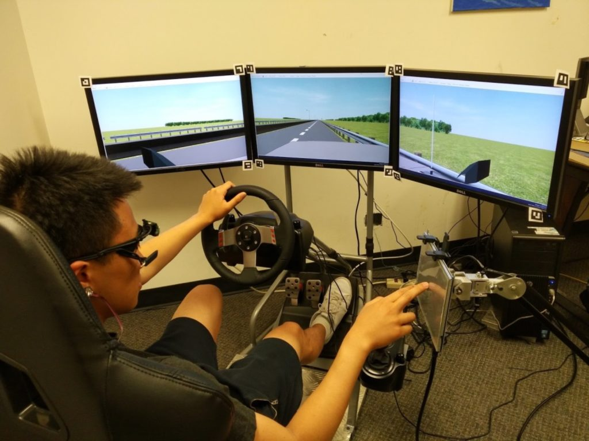
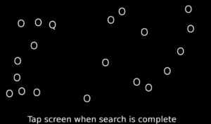

<figure>

<figcaption>

An upcoming obstacle sits in the road during a driving simulation that explores how drivers trust autonomous driving systems. Courtesy Lionel Robert.

</figcaption>

</figure>

If a driver does not trust an autonomous driving system, letting the computer take control can be as daunting as letting a teenager take the wheel. While not trusting a new driver might cause passengers to slam a phantom brake pedal or white-knuckle an arm rest, a driver who does not trust driverless systems might miss out on important safety benefits or even, as autonomous system advance, the ability to complete other tasks.

To improve trust in autonomous systems, researchers at the University of Michigan conducted virtual driving trials that found that the more information an automated driving system communicated about upcoming situations, the higher the level of trust a driver had in the system, and the better the driver performed on a task other than driving.

<!--more-->

“In previous research on trust and autonomous vehicles, it is assumed the driver will keep an eye on the system to take over driving at any time,” said [Lionel Robert](https://2024.robotics.umich.edu/profile/lionel-robert/), core faculty in Robotics and associate professor in the School of Information.

“In this study, we wanted drivers to be distracted and focus on a different task. The idea is to find a balance where drivers can perform well at a secondary task while maintaining situational awareness so that they can take back control and drive if necessary.”

Robert is an author on the paper outlining the research, “[Situational Awareness, Driver’s Trust in Automated Driving Systems and Secondary Task Performance](https://arxiv.org/pdf/1903.05251.pdf),” which will be published in SAE International Journal of Connected and Autonomous Vehicles. Other authors include Luke Petersen, MSE ME 2018, [X. Jessie Yang](https://2024.robotics.umich.edu/profile/xi-jessie-yang/), affiliate faculty in Robotics and assistant professor of industrial and operations engineering, and [Dawn M. Tilbury](https://2024.robotics.umich.edu/profile/dawn-tilbury/), core faculty in Robotics and professor in mechanical engineering.

<figure>

<figcaption>

A study participant drives the virtual car while completing a secondary task on a screen to the side. Courtesy Lionel Robert.

</figcaption>

</figure>

The experiment put participants behind the virtual wheel outfitted with lane-keeping, cruise control, and automatic emergency braking. The virtual car also alerted drivers with a recorded message using three different levels of information about upcoming obstacles: no information with no recorded message, low information with “stopped vehicle ahead,” and high information with “stopped vehicle ahead, take control now” or “stopped vehicle ahead, no action needed.”

During the drive, participants completed a task on another screen that mimicked their use of a smartphone or infotainment system, known as the surrogate reference task, in which they attempted to find the letter Q among many letter O’s. 

<figure>

<figcaption>

A screen shot of the secondary task where participants had to select the letter Q among many letter O's. Courtesy Lionel Robert.

</figcaption>

</figure>

Before, during, and after the drive, trust between human and computer driver was measured in many ways, including surveys, eye-tracking, heart rate, driving data, and secondary task performance.

Like any team collaboration, the study found that the better the communication, the better the driver and automated driving system worked together. When presented with the high information message, which increased a driver’s situational awareness of whether they would need to take control, the driver trusted the system more. A driver with this high situational awareness and trust in the system performed the best on the secondary task.

 “It is this pairing of trust in a driverless system and a system that offers high situational awareness that is needed for better performance in a secondary task,” Robert said. Drivers who trusted the system without it offering informative status updates and drivers who did not trust the system both performed similarly on the secondary task.

Also surprising to researchers, the drivers’ feelings on trust compared with their actions while driving did not match up. While drivers indicated they trusted the automated system the same whether it gave a low information message (“stopped vehicle ahead”) or a high information message (“stopped vehicle ahead, take control now”), they waited longer to take over control when hearing the high information message, which indicated greater trust in the system.

To explore these findings deeper, Robert and his team continue to study trust in automation with a focus on an autonomous driving system that is occasionally makes mistakes identifying the presence of upcoming obstacles.

This research was supported by the Automotive Research Center (ARC) at U-M and the Department of the Army grant W56HZV-14-2-0001 through the U.S. Army Tank Automotive Research, Development, and Engineering Center (TARDEC).
