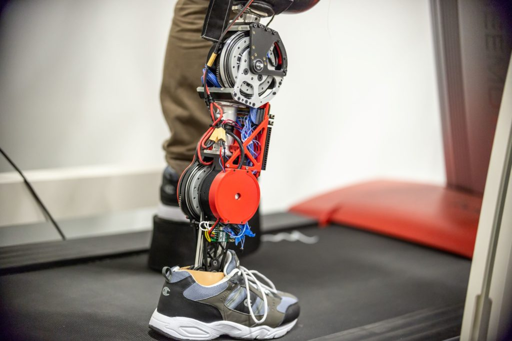
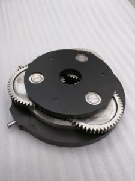

https://www.youtube.com/watch?v=GRT7FF2eVwU

A new robotic prosthetic leg prototype offers a more natural gait while also being quieter and more energy efficient than other designs. 

The key is the use of new small and powerful motors, originally designed for a robotic arm on the International Space Station. The streamlined design offers a free-swinging knee and regenerative braking, which charges the battery with energy captured when the foot hits the ground. This feature enables the leg to more than double a typical prosthetic user’s walking needs with one charge per day.

<!--more-->

“Our prosthetic leg consumes approximately half the battery power of state-of-art robotic legs, yet can produce more force,” said [Robert Gregg](https://gregg.engin.umich.edu/), an associate professor of electrical and computer engineering at the University of Michigan and a member of the U-M Robotics Institute, who led the study at The University of Texas at Dallas. Gregg moved to U-M last year. 

<figure>

<figcaption>

A student tests the robotic leg at the University of Texas at Dallas. The strong motors powering the knee and ankle can propel the user's body while allowing the knee to swing freely, with regenerative braking to extend battery life. Credit: University of Texas at Dallas.

</figcaption>

</figure>

Using conventional prosthetics, amputees must raise their hips to lift the prosthetic foot from the floor and swing the leg forward. This unnatural gait takes more energy than ordinary walking, causes extra stress and pain in the hips and lower back, and eventually damages the joints. Robotic legs have the potential to provide a much more comfortable gait, but one of their drawbacks is stiffness in the joints.

“We designed our joints to be as compliant, or flexible, as possible,” said Toby Elery, first author of the study and recent doctoral graduate from UT Dallas. “Our robotic leg can perform and even react like a human joint would, enabling a naturally free-swinging knee and shock absorption when contacting the ground.”

Motors in robotic legs need to fit into the space that an ordinary limb would take up. In the past, this has meant using small motors that spin quickly, and then using a series of gears to convert the fast spin into a more powerful force.

The problem is that the gears are noisy, inefficient, add weight and make it harder for the joints to swing freely. Gregg’s group surmounted this by incorporating two of those stronger space station motors, one powering the knee and the other powering the ankle.

<figure>

<figcaption>

The powerful motors mean that fewer gears are needed to generate torques as strong as human legs produce for activities like standing up and climbing stairs. With fewer gears, Gregg’s team was able to implement a free-swinging knee and regenerative braking to help the leg go all day on a single charge. Credit: Locomotor Control Systems Laboratory, University of Michigan.

</figcaption>

</figure>

There are many benefits to using fewer gears. In addition to enabling the free-swinging knee, removing gears brought the noise level down from the scale of a vacuum cleaner to a refrigerator. Also, the regenerative braking absorbs some of the shock when the prosthetic foot hits the ground.

“If the joints are stiff or rigid, the force is transferred to the residual limb, and that can be painful,” said Gregg. “Instead, we use that force to charge the battery.”

The amputees who test drive the prosthetics in Gregg’s lab report that they can feel the leg helping them push off the ground as they walk. 

“In some cases, they have observed that they feel like muscles in their hips and back are working less with our leg, compared to their conventional leg,” said Gregg. “We’re able to reduce compensations at the hips.”

The team’s next step is to improve the control algorithms that can help the leg automatically adjust to different terrain, changes in pace and transitions between different types of activity. 

The paper is titled, “[Design and validation of a powered knee-ankle prosthesis with high-torque, low-impedance actuators](https://ieeexplore.ieee.org/document/9139298),” and is published in the journal IEEE Transactions on Robotics.

The research is funded by the National Institutes of Health, the National Science Foundation and the Burroughs Wellcome Fund.

The University of Texas at Dallas and the University of Michigan are jointly pursuing patent protection. As Gregg continues his work at U-M, the U-M Tech Transfer is actively seeking commercial partners to help bring the technology to market.

O_riginally [published](https://news.engin.umich.edu/2020/07/space-motor-helps-make-robotic-prosthetic-leg-more-comfortable-and-extends-battery-life/) on Michigan Engineering._
