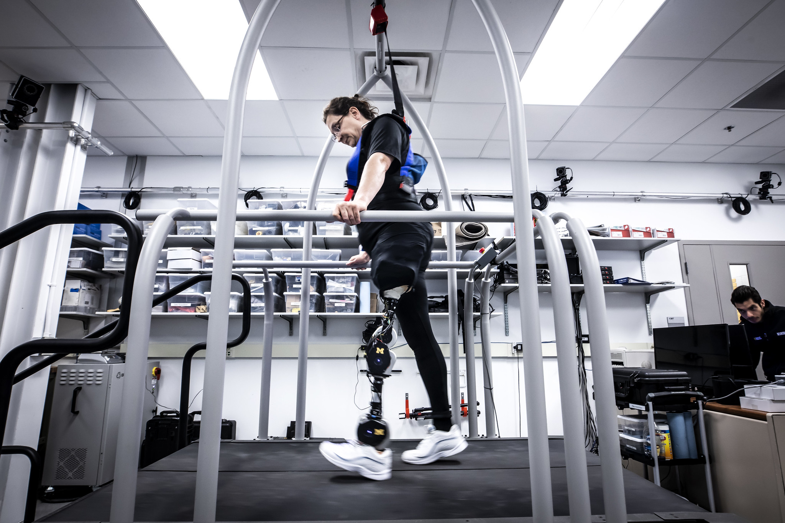

https://youtu.be/VUzxJCmo5v4

The open-source, artificially intelligent prosthetic leg designed by researchers at the University of Michigan will be brought to the research market by Humotech, a Pittsburgh-based assistive technology company.

The goal of the collaboration is to speed the development of control software for robotic prosthetic legs, which have the potential to provide the power and natural gait of a human leg to prosthetic users.

<!--more-->

"We developed the open-source leg to foster the study of control strategies for robotic prostheses—one of the most prominent barriers hindering their public impact," said [Elliott Rouse](https://2024.robotics.umich.edu/profile/elliott-rouse/), assistant professor of mechanical engineering and core faculty at U-M's Robotics Institute.

"The open-source leg is now being used by over 10 other research groups to develop control strategies on a common platform, but we noticed some research groups would rather not build it themselves. To maximize the benefit to the public, a product-like solution was needed."

First released in 2019, the open-source leg's free-to-copy design is intended to accelerate scientific advances by offering a unified platform to fragmented research efforts across the field of bionics. Now, for labs that need an off-the-shelf robotic prosthesis for research and development, Humotech will provide an assembled version of the open-source leg, including warranty service and technical support.

"We see many benefits to standardizing the hardware and software used by the research community," said Josh Caputo, president and CEO of [Humotech](https://humotech.com/). "The fully contained and powerful open-source leg is a natural expansion of what we can do to support our mission to transform the way the world develops wearable robotics.

"By offering a preassembled version with professional support, we hope to improve access to this platform for studying the control of robotic prosthetic legs. We're extremely excited to partner with the University of Michigan on this strategic initiative and together help accelerate research and innovation in the field."

<figure>

<figcaption>

Dawn Jordan Musil tests an open-source robotic leg designed by Elliott Rouse and his research group. Photo: Joseph Xu.

</figcaption>

</figure>

Humotech, originating from Carnegie Mellon University, develops tools for the advancement of wearable robotic control systems and other wearable devices. Using its own research community, Humotech will further build and support a development community around the open-source leg and seek to incorporate the leg into Humotech's Caplex platform. Caplex is a hardware and software testbed that enables researchers to emulate the mechanics of wearable machines, including prostheses and exoskeletons.

In collaboration, Rouse's lab and Humotech will also iterate on new versions of the open-source leg to meet the needs of prosthetic wearers and researchers.

The original prosthetic leg was designed to be simple, low-cost and high-performance. Its modular design can act as a knee, ankle or both, with an onboard power supply and control electronics that allow it to be tested anywhere. Rouse collaborated with Levi Hargrove, director of the Center for Bionic Medicine at the Shirley Ryan AbilityLab in Chicago, to develop this first model.

Rouse hopes Humotech's partnership will expand the capabilities of other labs, and enable them to conduct high-impact research. An example of such research that Rouse notes is a Nature Biomedical Engineering article, "[Design and clinical implementation of an open-source bionic leg](https://www.nature.com/articles/s41551-020-00619-3)," by former mechanical engineering doctoral student Alejandro Azocar. 

For researchers looking to build the leg on their own, the prosthetic's parts list, assembly instructions and programming remain [freely available online](https://opensourceleg.com/).

"This collaboration furthers the mission of our open-source leg project," Rouse said. "The translation of an open-source research prototype to a commercial product is rare for our field, but our partnership can continue to lower the barrier to research, speed technical advances, and in the end, positively impact lives."

_Written in collaboration with Danielle Commisso of Humotech._
