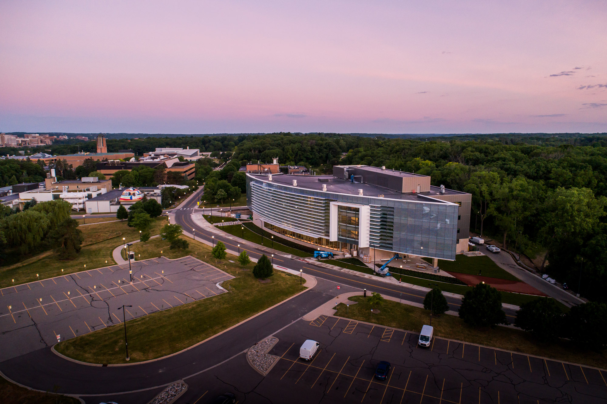
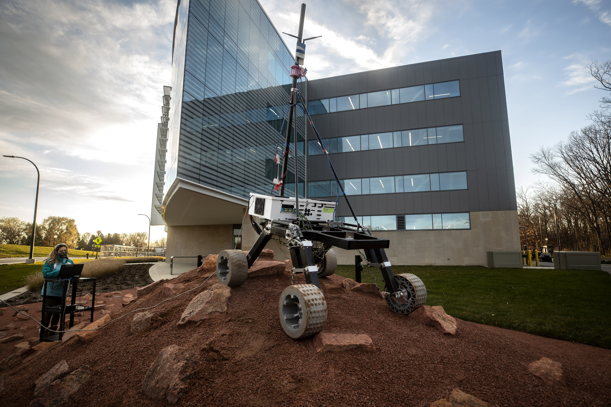
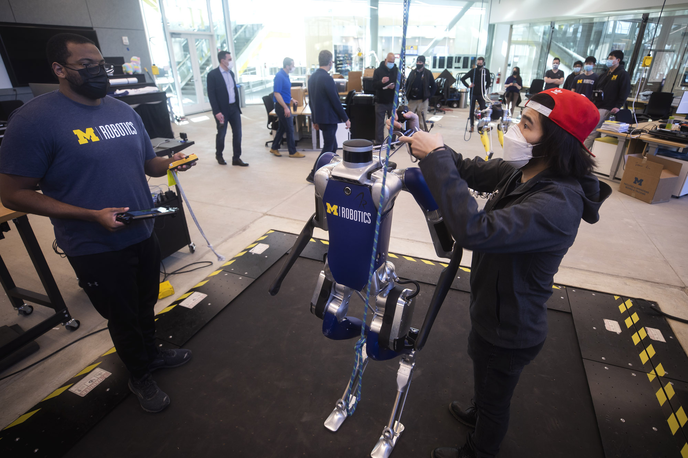
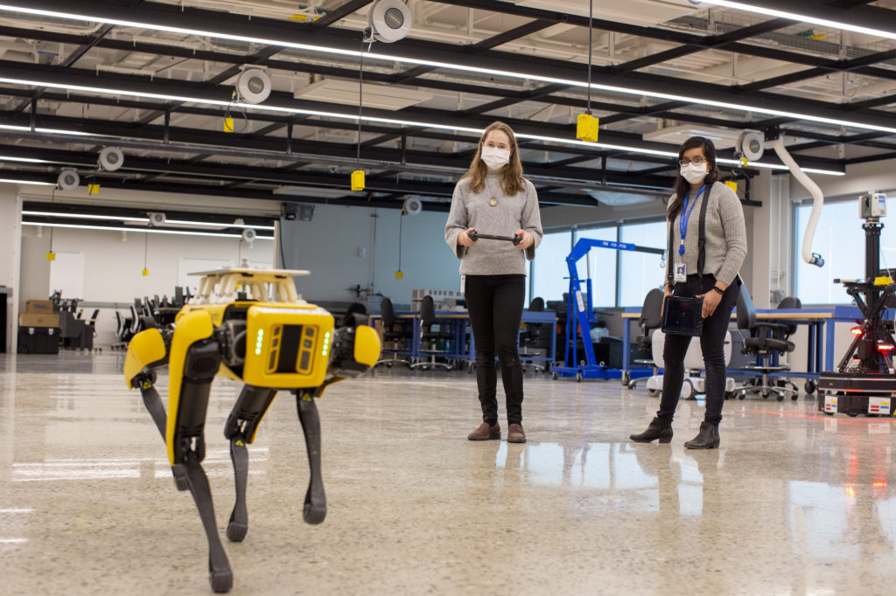

https://www.youtube.com/watch?v=Nckogu4XZ28

As robots and autonomous systems are poised to become part of our everyday lives, the University of Michigan and Ford Motor Company are opening a one-of-a-kind facility where they’ll develop robots and roboticists that help make lives better, keep people safer and build a more equitable society.

<!--more-->

U-M’s [Ford Motor Company Robotics Building](https://2024.robotics.umich.edu/about/ford-motor-company-robotics-building/ "Ford Robotics Building") is a four-story, $75 million, 134,000-square-foot complex situated on North Campus. As the new hub of the U-M Robotics Institute, its first three floors hold custom U-M research labs for robots that fly, walk, roll and augment the human body—as well as classrooms, offices and makerspaces. Through a unique agreement, the fourth floor houses Ford’s first robotics and mobility research lab on a university campus, as well as 100 Ford researchers and engineers.

https://sketchfab.com/3d-models/u-m-ford-motor-company-robotics-building-8b228b54b3bc4ccfa75c5d8cb872b4da

“To me, this new building brings to life a collaborative, interdisciplinary community that I’m proud to host at Michigan Engineering. Our Robotics Institute upholds an explicitly inclusive climate and a culture that believes in the field’s potential to serve as an enabler for all, especially those who have previously been underserved,” said [Alec D. Gallimore](https://aero.engin.umich.edu/people/alec-d-gallimore/), the Robert J. Vlasic Dean of Engineering, the Richard F. and Eleanor A. Towner Professor of Engineering, an Arthur F. Thurnau Professor and a professor of aerospace engineering. “In this way, we aim to push the robotics field, and engineering more broadly, to become equity-centered—intentionally closing, rather than unintentionally expanding, societal gaps.”

The new facility brings together U-M researchers from 23 different buildings and ten Top 10 programs. With the new infrastructure, researchers working on two-legged disaster response robots can test them on a 30-mph treadmill studded with obstacles, or on a stair-stepped “robot playground” designed with the help of artificial intelligence, for example. Biomedical engineers will have access to “earthquake platforms” with force feedback plates to guide their development of lighter-weight, more stable prosthetic legs. And Ford engineers will explore how their upright Digit robots can work in human spaces, while taking autonomous vehicles from robotic computer simulations to on-road testing at U-M’s world-class proving ground just down the road.

“As Ford continues the most profound transformation in our history with electrification, connectivity and automation, advancing our collaboration with the University of Michigan will help us accelerate superior experiences for our customers while modernizing our business,” said Ken Washington, chief technology officer, Ford Motor Company. “We also will broaden our learning through daily exposure to many robotics activities, such as considering how our Digit robots not only technically can master delivering packages from autonomous vehicles but also become valued parts of our neighborhoods.”

#### **Advanced, more diverse and equitable robotics**

The building’s architecture echoes the U-M Robotics Institute’s boundary-breaking and inclusive spirit. 

“This is a truly dazzling facility full of some of the most advanced research and teaching infrastructure in the world. But what I’m most excited about is the people it will bring together and what they will be able to accomplish collectively,” said [Jessy Grizzle](https://2024.robotics.umich.edu/profile/jessy-grizzle/), director of the U-M Robotics Institute, the Elmer G. Gilbert Distinguished University Professor of Engineering and the Jerry W. and Carol L. Levin Professor of Engineering.

The lobby is a wide-open atrium surrounded by transparent glass-walled labs. It was designed with outreach in mind, so passersby and visitors can watch research happen in real time. Classrooms are set up for hybrid instruction, and that was planned even before the pandemic. U-M and Ford are working together to harness that feature, as well as a more inclusive curriculum, in a collaboration with Morehouse and Spelman colleges, two historically Black institutions in Atlanta. Students from those schools can enroll remotely in [Robotics 101](https://2024.robotics.umich.edu/academic-program/course-offerings/rob101-fall-2020/ "ROB 101: Computational Linear Algebra"), a pilot course at U-M that doesn’t require calculus and levels the playing field for students from lower-resource high schools that didn’t offer advanced courses. 

#### **World-class labs for human-centered robotics**

The U-M Robotics Institute aims to advance human-centered robots—machines and systems that interact with people and move through our spaces, extending the human body and the process of human cognition. New labs enabling this include:

- The **Ronald D. and Regina C. McNeil Walking Robotics Laboratory** for developing and testing legged robots, with an in-ground treadmill that can hit 31 mph and a 20% grade, as well as carry obstacles. Walking robots could aid in disaster relief and lead to better prosthetics and exoskeletons.
- A **Rehabilitation Lab** for advanced prosthetics and robotic controls, with a movable “earthquake platform” that can tilt in any direction, while force-feedback plates measure ground contact.
- A **three-story fly zone** to test drones and other autonomous aerial vehicles indoors, before moving to the adjacent outdoor M-Air research facility. Autonomous aerial vehicles could perform safer inspection of infrastructure like windmills and bridges.
- A **Mars yard**, designed with input from planetary scientists at U-M and NASA, to enable researchers and student teams to test rover and lander concepts on a landscape that mimics the Martian surface.
- An **AI-designed “robot playground”** outdoor obstacle course for testing robots on stairs, rocks, and water, surrounded by motion capture cameras.
- **High-bay garage space** for self-driving cars, located just down the road from the [Mcity Test Facility](https://mcity.umich.edu/), for putting connected and automated vehicles through the paces in simulated urban and suburban environments.

“I don’t know of any building like this in the world,” said [Eric Michielssen](https://michielssen.engin.umich.edu/), associate dean for research at Michigan Engineering and the Louise Ganiard Johnson Professor of Engineering in electrical and computer engineering. “These state-of-the-art labs are fitted with some of the most advanced scientific instruments. Couple that with the fact that they will bring together researchers and students from across campus and beyond, and it’s clear this will be an unbelievable intellectual environment for the development of next-generation robots.”

For Ford, the facility is key to the company’s transformed and modernized research and product development processes aimed at disrupting the transportation landscape. Key research will focus on: 

- The future of moving goods more efficiently, as the pandemic further fuels online retail growth. Ford recently purchased several Digit robots, the first commercially available robot with arms and legs, to work with humans and in human spaces.
- Experimenting with a four-legged robot, Spot, to laser-scan plants – helping engineers update the original computer-aided design used to prepare to retool for new products.
- Self-driving vehicles and their role in the future of cities. Members of Ford’s autonomous vehicle team will work at the new facility. Ford’s approach incorporates purpose-built vehicles into a comprehensive and integrated autonomous vehicle operating system that enables choice, convenience and value for the movement of both people and goods.

“Autonomous vehicles have the opportunity to change the future of transportation and the way we move,” said Tony Lockwood, technical manager, Autonomous Vehicle Research, Ford Motor Company. “As this new technology rolls out, having our Ford team working on campus collaborating with the academic world will help us shorten the time it takes to move research projects to automotive engineering, unlocking the potential of autonomous vehicles.”

#### **Robots for any environment**

In addition to the M-Air drone cage and the Mcity Test Facility, the college is also home to the [Aaron Friedman Marine Hydrodynamics Lab](https://mhl.engin.umich.edu/), which houses a 360-foot-long indoor body of water for testing robotic and conventional watercraft. And its [Space Physics Research Lab](https://xtrm-sprl.engin.umich.edu/) develops and tests robotic spacecraft and instruments for deployment across the solar system. Inside the new building, researchers working on machines for each of those environments, and others, can learn from and inspire each other.

The Ford Robotics Building anchors the west end of the Michigan Avenue mobility testbed that begins in Detroit’s Corktown neighborhood and runs through Dearborn to Ann Arbor, where Ford and U-M are teaming with other innovators to experiment potential mobility solutions for the future.

In collaboration with the state of Michigan and others, Ford and U-M are involved in developing a first-of-its-kind corridor for connected and autonomous vehicles that will continue the state’s mission to lead the development of smart infrastructure and future mobility. A key goal of the initiative is to close long-standing gaps in access to public transit and transportation across Southeast Michigan.
