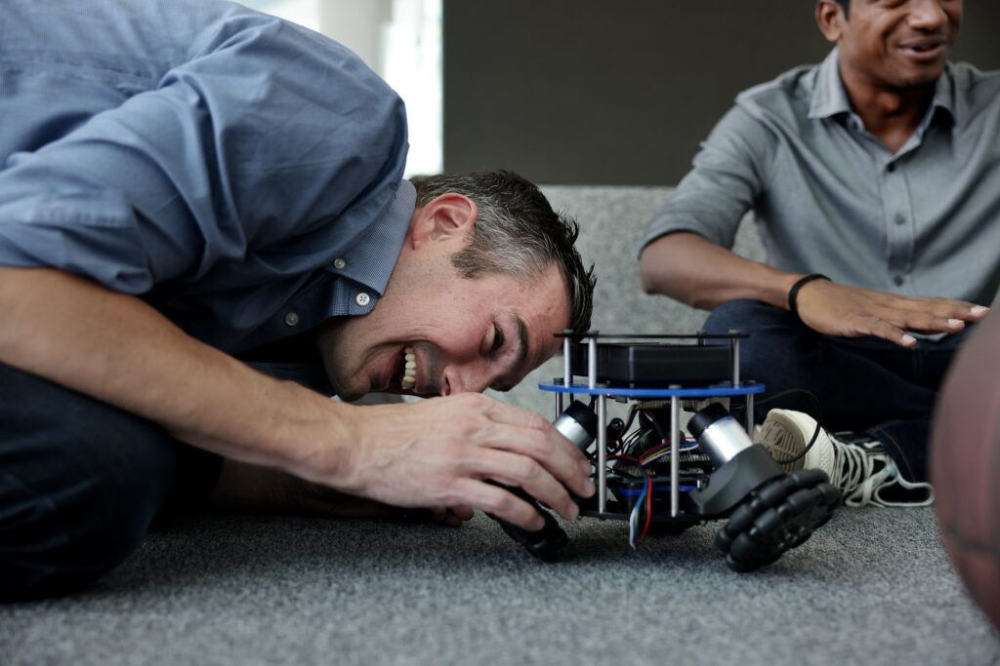

Congratulations to Professor [Elliott Rouse](https://2024.robotics.umich.edu/profile/elliott-rouse/ "Elliott Rouse"), who has earned the Robotics Department Faculty Award for his exceptional work in robotics. The award recognizes his achievements in several areas, including serving on the Robotics Executive Committee and being a key advocate for the establishment of the new Robotics Department, creating and teaching the new undergraduate course [ROB 311: How to Build Robots and Make Them Move](https://github.com/michiganrobotics/rob311), and for his significant strides in advancing the field of robotics.

Bringing a positive attitude, honest approach, and rigorous observational mindset, Rouse's work produces exceptional results from curriculum design to research.

<!--more-->

Over the past few years, Rouse has been instrumental in establishing the new Robotics Department. One example is the creation of ROB 311. Working with PhD student Yves Nazon and Senthur Ayyappan, Rouse designed a course that enrolled over 20 students in its pilot offering and covered mechanical design, control, fabrication, actuation, instrumentation, and the computer interfaces required to realize robotic systems. The class culminated in designing and building robots that balance on top of a basketballs and move by remote control.

<figure>

https://www.youtube.com/watch?v=SfUyfNA0fEE

<figcaption>

Rouse was fundamental in establishing "The Testing Lab," a public outreach event.

</figcaption>

</figure>

In research, Rouse's work spans wearable robotics and biomechanical science, studying how nervous system controls the body and designing devices to provide assistance to impaired limbs, augment human ability, or help with rehabilitation. He has pioneered new descriptions of how leg joint stiffness is regulated by the nervous system during locomotion, discovering a key misconception in the relationship between the stiffness, torque, and angle of the leg. Building on this discovery, Rouse characterized how stiffness is regulated during locomotion and is using this data across a variety of new assistive technologies, including the first _variable-stiffness_ ankle-foot prosthetic, which can adapt to a user's comfort or activities as opposed to traditionally fixed-stiffness models.

Rouse has also translated research into significant impact with the [Open Source Leg](https://opensourceleg.com/) project. First released in 2019, the open-source leg’s free-to-copy design offers a unified platform to fragmented research efforts across the field of bionics. In 2021, Rouse partnered with Humotech to provide labs with an off-the-shelf version for research and development, and his lab continues to iterate, recently releasing an updated version that is less costly. Such work unlocks the potential of robotics, and can greatly improve the quality of life for people.

The Robotics Department is fortunate to have Rouse as a member of its faculty and we are proud to honor him with this award. He continues to be an example of the Robotics Department's values, as he consistently approaches colleagues and efforts with respect, integrity, and a passion to share the positive possibilities ahead.
