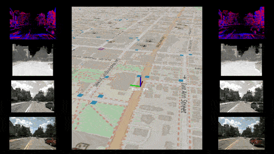
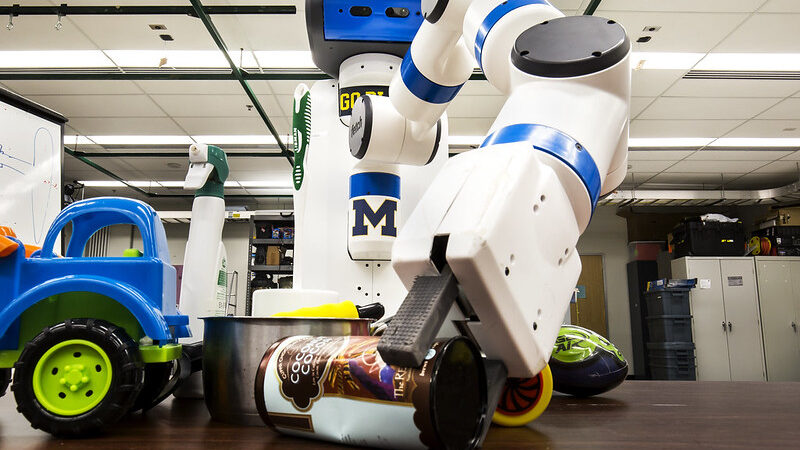
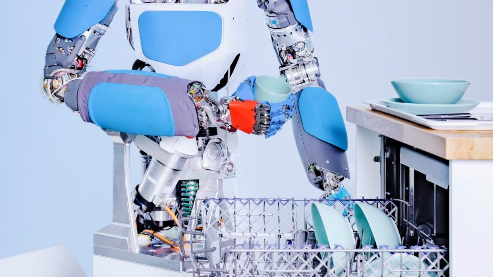
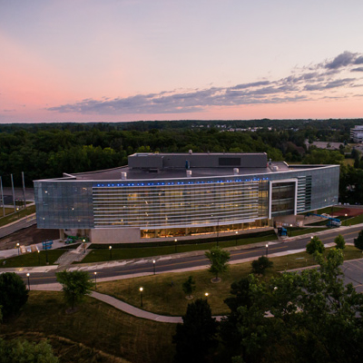

<figure>

<figcaption>

Detroit skyline. Image by Peter Mol from Pixabay.

</figcaption>

</figure>

Roboticists descend on the Motor City for the [2023 IEEE/RSJ International Conference on Intelligent Robots and Systems](https://ieee-iros.org) (IROS) from October 1st through 5th. IROS serves as a significant annual platform for robotics researchers to present and investigate advancements in intelligent robots and smart machines. Researchers from the University of Michigan in Ann Arbor have a short commute this year, as they showcase the work done at Michigan.

Below are highlights of what Michigan roboticists are bringing this year.

<!--more-->

## Workshops on prostheses, autonomous perception, mapping, learning and more

The first and last day of the conference are full of workshops and tutorials with a variety of topics: agricultural robotics, climate resiliency, and robotics that can help gastrointestinal diseases. U-M researchers are helping organizing and are presenting at several of the workshops, with a few features below.

### [Novel Sensors for Autonomous Vehicle Perception](https://ieee-iros.org/workshops-tutorials/#1686885093577-c5815f4c-5a4c)

More information

Organizers: _Katie Skinner, Ram Vasudevan, Manikandasriram Srinivasan Ramanagopal, Radhika Ravi, Austin Buchan, Spencer Carmichael, Gaurav Pandey, Alexandra (Alexa) Carlson_

Current systems for autonomous vehicle (AV) perception rely on widely used sensors such as cameras and LiDAR systems. However, AV perception systems based on conventional sensors suffer in various lighting and adverse weather conditions. For example, conventional visual frame-based cameras are widely used due to their low-cost and high spatial resolution. Yet, AV perception systems based on conventional cameras are challenged by low-light conditions, fog, rain, and snow, and suffer from issues including motion blur, limited frame rates, and low dynamic range. Novel sensors, such as event and thermal cameras, offer alternatives that address these limitations. Event cameras feature high temporal resolution, effectively no motion blur, high dynamic range, low power requirements, and low latency. These qualities make event cameras promising under adverse lighting, fast motion, and resource constraints. Thermal cameras sensitive to the Long Wave Infrared spectrum can operate in the absence of visible light and are robust to changes in illumination and visual obscurants such as fog, dust, and smoke. Alongside these advantages are challenges: thermal cameras are lower contrast and experience greater motion blur, while event cameras represent a new paradigm that is not directly compatible with existing algorithms. Advancing AV capabilities to leverage novel sensors will require further research development across academia and industry. This workshop seeks to engage the research community in discussion of exciting new research topics in novel sensors for AV perception, and will feature the release of a unique dataset for AV perception with novel sensors, and a student poster session.

[Website](https://sites.google.com/umich.edu/novelsensors2023)

https://www.youtube.com/watch?v=DObM6gXdK7U

### [State of the Art in Robotic Leg Prostheses: Where We Are and Where We Want to Be](https://ieee-iros.org/workshops-tutorials/#1686887978484-76bab070-9c32)

More information

Organizers**:** _Tommaso Lenzi, Bobby Gregg, Elliott Rouse_

Ambulation with conventional prostheses is slower, less stable, and less efficient than able-bodied ambulation, causing reduced mobility and quality of life. Robotic powered prostheses have the potential to close the gap between the performance of existing lower limb prostheses and human legs. In contrast to conventional passive prostheses, powered prostheses can provide biomechanically-accurate kinetics and kinematics, including during activities that require energy injection. Powered prostheses have evolved from devices tethered to a power supply or computer to devices that have onboard electronics and batteries. Powered prosthetic devices are now able to assist during walking, ambulation on stairs and ramps, and sit-stand transitions. However, there are significant challenges that the field needs to address for powered prostheses to fully realize their potential. Powered prostheses are often heavy, bulky, noisy, and fragile compared to conventional prostheses. Even the most advanced controllers cannot match the agility of the human body. Powered prostheses have made many advances but there are still challenges that must be addressed. This workshop will focus on the state-of-the-art and open challenges in powered prosthetics. Top researchers in the field will present their current and future approaches to designing and controlling powered prostheses. Live demonstration of powered prostheses will provide hands-on experience with leading technology. Poster sessions and panel discussions will provide further opportunities for participants to interact. This workshop will allow both established researchers and those new to the field of robotic prostheses, to experience where the field is today and what challenges lie ahead.

**[Website](https://belab.mech.utah.edu/iros2023/)** 

### [Differentiable Probabilistic Robotics: Emerging Perspectives on Robot Learning](https://ieee-iros.org/workshops-tutorials/#1686862481763-d2c82545-5adf)

More information

Organizers: _Jana Pavlasek, Anthony Opipari, Tom Power, Tucker Hermans, Fabio Ramos, Chad Jenkins_

Advances in robot learning in recent years have yielded outstanding performance across robotic tasks, compelling roboticists to reexamine the role of long-standing, reliable probabilistic inference algorithms. Probabilistic methods have a long history of enabling effective operation under uncertain and unstructured environments and provide a unifying perspective on perception, control and learning. Robot learning, on the other hand, promises generalizability, eliminating the need for carefully hand-crafted models required in many classical probabilistic algorithms. However, it remains unclear whether we can achieve reliable, adaptable behavior by relying on data alone. This workshop sets out to address the question: How can roboticists achieve the best of both deep learning and probabilistic inference? Recently, the robotics community has seen an emergence of interest in hybrid methods which aim to exploit the benefits of both underlying model classes. Key developments in Differentiable Probabilistic Robotics have included the introduction of learned components within inference frameworks and end-to-end differentiable algorithms for Bayesian inference. These methods offer the opportunity to develop robust and reliable learning and adaptive systems. This workshop aims to connect researchers working at the intersection of robotics, deep learning, and probabilistic inference to facilitate breakthrough research in these areas.

[Website](https://diff-prob-rob.org)

### [No More Slow Flexible Robots](https://ieee-iros.org/workshops-tutorials/#1686883543299-7586b58b-932c)

More information

Organizers: _Sehoon Oh, Jinoh Lee, Manuel Keppler, Nicholas Paine and Elliott J Rouse_

Emerging robotic systems hold the potential to transform nearly every aspect of daily life. However, while substantial contributions have been made in artificial intelligence, the physical abilities of most robotic systems remain limited; these systems often move slowly when performing precise motions and present challenges in scalability and adaptability across different uses. Flexible robots containing various elastic components that provide a host of potential benefits, including compliance, energy storage, and shock tolerance, making them suitable for a wide range of applications, such as rehabilitation, exploration and rescue, and collaborative robots. Despite this promise, the motion of elastic robots has been limited in terms of speed and highly dynamic motion; to solve the challenges of rapid, dynamic motion with flexible robotic systems requires a comprehensive approach. This workshop aims to bring together experts in the field of elastic robots to discuss the latest techniques and applications in the highly dynamic motion of flexible robots. 1) To provide a forum for researchers and practitioners to present and discuss the advances to realize dynamic motions on flexible/elastic robots. 2) To identify the challenges and opportunities in high-speed motions of flexible/elastic robots as an emerging research topic to be addressed. 3) To promote collaboration and knowledge sharing among researchers and practitioners in the field.

[Website](https://sites.google.com/view/flexible-robots-iros23-ws)

### WIE Luncheon and Networking - Women Shaping the Future of Robotics

More information

Panelists:  
Andra Keay, Silicon Valley Robotics  
Dawn Tilbury, University of Michigan

Pioneer women roboticists will share their insights on how one can navigate industry and academia, and on the role of women in bringing robotics to the real world! Also, don’t miss the chance to network with other roboticists!

[Register](https://app.smartsheet.com/b/form/9862a6a6230140deb65b12611a3b3b86?mkt_tok=NzU2LUdQSC04OTkAAAGOUmbbi9A7UuDKih2nVM7Dl8u8cV1pYLkQuyOLMENywdDt6vut5cl-4cG0CnN0ZQsS3jwu3g-t1Vafz8_0bSkkx-JUm_JYXBv-S-cafTPvPP0)

### IEEE RAS Robotics Foundation Cluster Forum

More information

Chairpersons:  
Marcelo Ang, National University of Singapore  
Giuseppe Loianno, New York University  
Josie Hughes, EPFL  
Jen Jen Chung, The University of Queensland  
  
Speakers:  
Rebecca Kramer-Bottiglio, Yale University  
Dawn Tilbury, University of Michigan  
Aude Billard, EPFL

This is the second forum hosted by the IEEE RAS Robotics Foundation Technical Cluster. This forum will provide an opportunity for students to hear from distinguished researchers across the breadth of robotics, including plenary talks and panels that cover the foundations of a topic as well as a view to the future.

[Register](https://docs.google.com/forms/u/1/d/e/1FAIpQLSdrH9Yo_xGSOSe0f__-bO1zegl4xQzt7Kyh3_ymVSw63Hd6Jg/viewform?usp=send_form)

## Discussing how to teach robotics

<figure>

https://www.youtube.com/watch?v=jZ0U339ewKo

<figcaption>

ROB 102, one of the new undergraduate robotics courses at U-M.

</figcaption>

</figure>

At one of the forum's this year, participants can exchange ideas and best practices in formal Robotics education at the undergraduate and graduate levels. Organized by Dawn Tilbury, U-M Robotics Department Chair, and Jing Xiao, Head of Robotics Engineering Department at Worcester Polytechnic Institute, the forum will present survey results gathered over the summer covering topics such as curriculum, enrollment, faculty expertise, capstone design, course projects, instructional labs, and equipment.

Also helping to inform this forum, [U-M launched an undergraduate robotics program](https://2024.robotics.umich.edu/2022/new-u-m-undergraduate-robotics-program/) last fall, which now has over 100 declared majors. This joins U-M's graduate program in robotics, which has almost a decade of history granting masters and doctoral degrees.

### **Formal Robotics Education Programs: Best Practices and Future Opportunities**

#### **Thursday, October 5,** **8:30am – 5:30pm**

**Room: 250B**

The goal of the full-day Forum is to exchange ideas and best practices in formal Robotics education at the undergraduate and graduate levels.

[Website](http://2024.robotics.umich.edu/irosforum)

## **Stop by our booth at IROS**

In the exhibition hall at booth 221, we will be showing off our Michigan-designed and built educational robot that helps us teach both undergraduate and graduate robotics courses. We would love to chat and connect–please take the time to stop by!

## Papers and research presentations

U-M researchers are also presenting several works across a multitude of focus areas. All the papers being presented at IROS are [available here](https://ras.papercept.net/conferences/conferences/IROS23/program/), and below are ones from U-M authors.

**gatekeeper: Safety Verification and Control for Nonlinear Systems in Unknown and Dynamic Environments**  
Devansh Agrawal, Ruichang Chen, Dimitra Panagou  
Collision AvoidanceMotion and Path Planning

This paper presents the gatekeeper algorithm, a real-time and computationally-lightweight method to ensure that nonlinear systems can operate safely within unknown and dynamic environments despite limited perception. Gatekeeper integrates with existing path planners and feedback controllers by introducing an additional verification step that ensures that proposed trajectories can be executed safely, despite nonlinear dynamics subject to bounded disturbances, input constraints, and partial knowledge of the environment. Our key contribution is that:

1. We propose an algorithm to recursively construct committed trajectories.
2. We prove that tracking the committed trajectory ensures the system is safe for all time into the future.

The method is demonstrated on a complicated firefighting mission in a dynamic environment and is compared against state-of-the-art techniques for similar problems.

**Impact of Imperfect Exoskeleton Algorithms on Step Characteristics, Task Performance, and Perception of Exoskeleton Performance**  
Man I Wu, Leia Stirling  
Prosthetics and ExoskeletonsHuman-Robot Collaboration

Lower-limb exoskeletons may experience errors in operational settings, where an expected assistive torque is missing. These errors may affect the user's gait strategies and perception of the exoskeleton's performance, leading to impacted human-exoskeleton fluency and user trust in the system. In this study, we introduced five different exoskeleton control algorithms with fixed error rates up to 10% error (90% accuracy). Two groups of participants (N=12, 6 per group) walked with a bilateral ankle exoskeleton while completing a targeted stepping task and experienced each controller twice, but in different orders. The impact of exoskeleton error rates was assessed on step characteristics (step length and width), task performance (absolute task error), and perception of exoskeleton performance (survey responses). Step characteristics were not impacted by exoskeleton errors, but multiple participants were not able to achieve acceptable task accuracy and increased task error over time across all error rates. Increasing error rates negatively impacted users' perception of algorithm predictability, exoskeleton supportiveness, and probability of future usage. The threshold where perceived predictability and future usage probability transitioned from positive to negative occurred between 2% and 5% error. Understanding the effect of increasing exoskeleton error rates informs minimum algorithm accuracy to support human-exoskeleton fluency and performance for gait-assist exoskeletons.

**Investigations into Customizing Bilateral Ankle Exoskeletons to Increase Vertical Jumping Performance**  
Emily A. Bywater, Roberto Medrano, Elliott Rouse  
Prosthetics and ExoskeletonsHuman Performance Augmentation

Exoskeletons have shown great potential to enhance locomotion by augmenting the lower limb. While most research has focused on steady-state ambulatory activities, the ability to assist transient, ballistic tasks is also important for understanding the role of exoskeletons in mobility enhancement. In this preliminary study (N = 5), we developed an individually-customized control strategy to assist vertical jumping. The control strategy was deployed on bilateral ankle exoskeletons (ExoBoot, Dephy Inc.). We structured the control strategy as a work loop that parameterized the assistance provided during the jump. We show that configuring the controller based on individual biomechanics and user preferences facilitates increased vertical jump height when using exoskeleton assistance. In addition, we demonstrate that a user's squat depth can have a significant (p < 0.05) impact on height achieved, but that this depth does not need to be optimized; rather, the exoskeleton provides the maximum performance assistance from both preferred- and deep-squat conditions. Jump height increased by 7.2% with the exoskeleton at its maximum assistance setting, which is comparable or greater than previous systems.

**Real-Time Gait Phase and Task Estimation for Controlling a Powered Ankle Exoskeleton on Extremely Uneven Terrain**  
Roberto Medrano, Gray Thomas, Connor Keais, Elliott Rouse, Robert D. Gregg  
Wearable RobotsHuman Performance Augmentation

Positive biomechanical outcomes have been reported with lower-limb exoskeletons in laboratory settings, but these devices have difficulty delivering appropriate assistance in synchrony with human gait as the task or rate of phase progression change in real-world environments. This paper presents a controller for an ankle exoskeleton that uses a data-driven kinematic model to continuously estimate the phase, phase rate, stride length, and ground incline states during locomotion, which enables the real-time adaptation of torque assistance to match human torques observed in a multi-activity database of 10 able-bodied subjects. We demonstrate in live experiments with a new cohort of 10 able-bodied participants that the controller yields phase estimates comparable to the state of the art, while also estimating task variables with similar accuracy to recent machine learning approaches. The implemented controller successfully adapts its assistance in response to changing phase and task variables, both during controlled treadmill trials (N=10, phase RMSE: 4.8 ± 2.4%) and a real-world stress test with extremely uneven terrain (N=1, phase RMSE: 4.8 ± 2.7%).

**An Energetic Approach to Task-Invariant Ankle Exoskeleton Control**  
Katharine Walters, Gray Thomas, Jianping Lin, Robert D. Gregg  
Prosthetics and ExoskeletonsWearable Robotics

Robotic ankle exoskeletons have been shown to reduce human effort during walking. However, existing ankle exoskeleton control approaches are limited in their ability to apply biomimetic torque across diverse tasks outside of the controlled lab environment. Energy shaping control can provide task-invariant assistance without estimating the user's state, classifying task, or reproducing pre-defined torque trajectories. In previous work, we showed that an optimally task-invariant energy shaping controller implemented on a knee-ankle exoskeleton reduced the effort of certain muscles for a range of tasks. In this paper, we extend this approach to the sensor suite available at the ankle and present its implementation on a commercially-available, bilateral ankle exoskeleton. An experiment with three healthy subjects walking on a circuit and on a treadmill showed that the controller can approximate biomimetic profiles for varying terrains and task transitions without classifying tasks or switching control modes.

**Effects of Personalization on Gait-State Tracking Performance Using**  
Jose Montes-Perez, Gray Thomas, Robert D. Gregg  
Prosthetics and ExoskeletonsMachine Learning for Robot Control

Emerging partial-assistance exoskeletons can enhance able-bodied performance and aid people with pathological gait or age-related immobility. However, every person walks differently, which makes it difficult to directly compute partial-assistance torques from joint kinematics. Gait-state estimation-based control allows more consistent behavior between users by using phase (normalized stride time) and task variables (e.g., stride length and ground inclination) to parameterize the joint torques. Using kinematic models that depend on the gait-state, prior work has used extended Kalman filter (EKF) to estimate the gait-state online. However, the EKF also suffers from kinematic errors since it uses a subject-independent measurement model, and it is still unknown how personalization of this measurement model would reduce gait-state tracking error. This paper quantifies how much gait-state tracking improvement a personalized measurement model can have over a subject-independent measurement model when using an EKF-based gait-state estimator. Since the EKF performance depends on the measurement model covariance matrix, we tested on multiple different tuning parameters. Across reasonable values of tuning parameters that resulted in good performance, personalization improved estimation error on average by 8.5 ± 13.8% for phase (mean ± standard deviation), 27.2 ± 8.1% for stride length, and 10.5 ± 13.5% for ground inclination. These findings support the hypothesis that personalization of the measurement model significantly improves gait-state estimation performance in EKF based gait-state tracking (P < 0.05), which could ultimately enable reliable responses to faster human gait changes.

**Fully Proprioceptive Slip-Velocity-Aware State Estimation for Mobile Robots via Invariant Kalman Filtering and Disturbance Observer**  
Xihang Yu, Sangli Teng, Theodor Chakhachiro, Wenzhe Tong, Tingjun Li, Tzu-Yuan Lin, sarah koehler, Manuel Ahumada, Jeffrey Walls, Maani Ghaffari  
Wheeled RobotsLocalization

This article presents a new slip estimator for mobile robots that employs the Disturbance Observer (DOB) and the invariant observer design theory. The proposed state estimator is entirely proprioceptive and combines data from an inertial measurement unit and body velocity. It uses a Right Invariant Extended Kalman Filter (RI-EKF) and embeds the slip velocity, together with spatial vectors (velocity and position), into the standard RI-EKF on the Lie group SE(3). By doing so, the slip velocity is represented as an additive Lie group structure, and the entire state is formed on the Lie group SE3(3). Furthermore, this research investigates the observability of the proposed observer and demonstrates that it is fully observable. The DOB-based RI-EKF provides precise, real-time estimates of velocity and slip velocity on various terrains. Experimental results using a Husky wheeled robot confirm the mathematical derivations and show better performance than a standard RI-EKF baseline. Open source software is available for download and reproducing the presented results.

**Stair Climbing using the Angular Momentum Linear Inverted Pendulum Model and Model Predictive Control**  
Oluwami Dosunmu-Ogunbi, Aayushi Shrivastava, Grant Gibson, J.W Grizzle  
Humanoid and Bipedal Locomotion

A new control paradigm using angular momentum and foot placement as state variables in the linear inverted pendulum model has expanded the realm of possibilities for the control of bipedal robots. This new paradigm, known as the ALIP model, has shown effectiveness in cases where a robot's center of mass height can be assumed to be constant or near constant as well as in cases where there are no non-kinematic restrictions on foot placement. Walking up and down stairs violates both of these assumptions, where center of mass height varies significantly within a step and the geometry of the stairs restrict the effectiveness of foot placement. In this paper, we explore a variation of the ALIP model that allows the length of the virtual pendulum formed by the robot's stance foot and center of mass to follow smooth trajectories during a step. We couple this model with a control strategy constructed from a novel combination of virtual constraint-based control and a model predictive control algorithm to stabilize a stair climbing gait that does not solely rely on foot placement. Simulations on a 20-degree of freedom model of the Cassie biped in the SimMechanics simulation environment show that the controller is able to achieve periodic gait.

**Exploring Kinodynamic Fabrics for Reactive Whole-Body Control of Underactuated Humanoid Robots**  
Alphonsus Adu-Bredu, Grant Gibson, J.W Grizzle  
Mobile ManipulationHumanoid and Bipedal Locomotion

For bipedal humanoid robots to successfully operate in the real world, they must be competent at simultaneously executing multiple motion tasks while reacting to unforeseen external disturbances in real-time. We propose Kinodynamic Fabrics as an approach for the specification, solution, and simultaneous execution of multiple motion tasks in real-time while being reactive to dynamism in the environment. Kinodynamic Fabrics allows for the specification of prioritized motion tasks as forced spectral semi-sprays and solves for desired robot joint accelerations at real-time frequencies. We evaluate the capabilities of Kinodynamic Fabrics on diverse physically-challenging whole-body control tasks with a bipedal humanoid robot both in simulation and in the real-world. Kinodynamic Fabrics outperforms the state-of-the-art Quadratic Program based whole-body controller on a variety of whole-body control tasks on run-time and reactivity metrics in our experiments. Our open-source implementation of Kinodynamic Fabrics as well as robot demonstration videos can be found at this URL: https://adubredu.github.io/kinofabs.

**Time-Optimal Spiral Trajectories with Closed-Form Solutions**  
Mark Draelos  
Motion and Path Planning, Dynamics

The Archimedean spiral is a space-filling plane curve that is found in applications ranging from coverage path planning for robot exploration to scan pattern generation for medical imaging. The constant linear velocity (CLV) parameterization of this spiral is of particular interest due to its fixed path velocity and isotropic sampling capability, but the high accelerations near its origin singularity yield poor trajectory tracking that limits its utility. Here, I derive a closed-form time-optimal time scaling for CLV spirals with large path velocities that mitigates the singularity by inspecting the CLV spiral's acceleration envelope. When applied to a two degree-of-freedom Cartesian scanner, I demonstrate that this approach reduces trajectory tracking error by up to 97.1% as compared to naive CLV spirals with low computational overhead. I further show that this time scaling eliminates the central image distortion near the origin for scanning applications that rely on CLV spirals.

**Online Submodular Coordination with Bounded Tracking Regret: Theory, Algorithm, and Applications to Multi-Robot Coordination**  
Zirui Xu, Hongyu Zhou, Vasileios Tzoumas  
Multi-Robot Systems, Planning under Uncertainty

We enable efficient and effective coordination in unpredictable environments, i.e., in environments whose future evolution is unknown a priori and even adversarial. We are motivated by the future of autonomy that involves multiple robots coordinating in dynamic, unstructured, and adversarial environments to complete complex tasks such as target tracking, environmental mapping, and area monitoring. Such tasks are often modeled as submodular maximization coordination problems. We introduce the first submodular coordination algorithm with bounded tracking regret, i.e., with bounded suboptimality with respect to optimal time-varying actions that know the future a priori. The bound gracefully degrades with the environments' capacity to change adversarially. It also quantifies how often the robots must re-select actions to "learn" to coordinate as if they knew the future a priori. The algorithm requires the robots to select actions sequentially based on the actions selected by the previous robots in the sequence. Particularly, the algorithm generalizes the seminal Sequential Greedy algorithm by Fisher et al. to unpredictable environments, leveraging submodularity and algorithms for the problem of tracking the best expert. We validate our algorithm in simulated scenarios of target tracking.

**Robust Task Scheduling for Heterogeneous Robot Teams under Capability Uncertainty**  
Bo Fu, William Smith, Denise M. Rizzo, Matthew P. Castanier, Maani Ghaffari, Kira Barton  
PlanningScheduling and CoordinationPath Planning for Multiple Mobile Robots or Agents

This paper develops a stochastic programming framework for multi-agent systems where task decomposition, assignment, and scheduling problems are simultaneously optimized. The framework can be applied to heterogeneous mobile robot teams with distributed sub-tasks. Examples include pandemic robotic service coordination, explore and rescue, and delivery systems with heterogeneous vehicles. Due to their inherent flexibility and robustness, multi-agent systems are applied in a growing range of real-world problems that involve heterogeneous tasks and uncertain information. Most previous works assume a unique way to decompose a task into roles that can later be assigned to the agents. This assumption is not valid for a complex task where the roles can vary and multiple decomposition structures exist. Meanwhile, it is unclear how uncertainties in task requirements and agent capabilities can be systematically quantified and optimized under a multi-agent system setting. A representation for complex tasks is proposed: agent capabilities are represented as a vector of random distributions, and task requirements are verified by a generalizable binary function. The conditional variability in capability requirements is used to build a robust model that captures the trade-off between scheduling risk and expected costs. The proposed framework is validated through simulations and real-world testing.

**Improving Amputee Endurance over Activities of Daily Living with a Robotic Knee-Ankle Prosthesis: A Case Study**  
T. Kevin Best, Curt A. Laubscher, Ross Cortino, Shihao Cheng, Robert D. Gregg  
Prosthetics and ExoskeletonsRehabilitation Robotics

Robotic knee-ankle prostheses have often fallen short relative to passive microprocessor prostheses in time-based clinical outcome tests. User ambulation endurance is an alternative clinical outcome metric that may better highlight the benefits of robotic prostheses. However, previous studies were unable to show endurance benefits due to inaccurate high-level classification, discretized mid-level control, and insufficiently difficult ambulation tasks. In this case study, we present a phase-based mid-level prosthesis controller which yields biomimetic joint kinematics and kinetics that adjust to suit a continuum of tasks. We enrolled an individual with an above-knee amputation and challenged him to perform repeated, rapid laps of a circuit comprising activities of daily living with both his passive prosthesis and a robotic prosthesis. The participant demonstrated improved endurance with the robotic prosthesis and our mid-level controller compared to his passive prosthesis, completing over twice as many total laps before fatigue and muscle discomfort required him to stop. We also show that time-based outcome metrics fail to capture this endurance improvement, suggesting that alternative metrics related to endurance and fatigue may better highlight the benefits of robotic prostheses.

**Lightweight Semantic Segmentation Network for Semantic Scene Understanding on Low-Compute Devices**  
Hojun Son, James Weiland  
Semantic Scene UnderstandingEmbedded Systems for Robotic and Automation

Semantic scene understanding is beneficial for mobile robots. Semantic information obtained through on-board cameras can improve robots' navigation performance. However, it is challenging to obtain semantic information on small mobile robots with constrained power and computation resources. We propose a new lightweight convolutional neural network that is comparable to previous semantic segmentation algorithms for mobile applications. Our network achieved 73.06% on the Cityscapes validation set and 71.8% on the Cityscapes test set. Our model runs at 116 fps with 1024x2048, 172 fps with 1024x1024, and 175 fps with 720x960 on NVIDIA GTX 1080. We analyze a model size which is defined as the summation of the number of floating operations and the number of parameters. The smaller model size enables tiny mobile robot systems that should operate multiple tasks simultaneously to work efficiently. Our model has the smallest model size compared to the real-time semantic segmentation convolutional neural networks ranked on Cityscapes real-time benchmark and variable lightweight convolutional neural networks. On the Camvid test set, our model achieved an mIOU of 73.29% with Cityscapes pre-trained, which outperformed the accuracy of other lightweight convolutional neural networks. For mobile applicability, we measured frame-per-second on different low-compute devices including a smartphone. Our model operates at 35 fps on Jetson Xavier AGX, 21 fps on Jetson Xavier NX, and 14 fps on a ROS ASUS gaming phone. 1024x2048 resolution is used for the Jetson devices, and 512x512 size is utilized for the measurement on the phone. Our network did not use extra datasets such as ImageNet, Coarse Cityscapes, and Mapillary. Additionally, we did not use TensorRT to achieve fast inference speed. Compared to other real-time and lightweight CNNs, our model achieved significantly more efficiency and optimal trade-off of accuracy, inference speed, and model size.

**Reward Shaping for Building Trustworthy Robots in Sequential Human-Robot Interaction**  
Yaohui Guo, X. Jessie Yang, Cong Shi  
Human-Robot TeamingHuman-Centered Automation

Trust-aware human-robot interaction (HRI) has received increasing research attention, as trust has been shown to be a crucial factor for effective HRI. Research in trust-aware HRI discovered a dilemma — maximizing task rewards often leads to decreased human trust, while maximizing human trust would compromise task performance. In this work, we address this dilemma by formulating the HRI process as a two-player Markov game and utilizing the reward-shaping technique to improve human trust while limiting performance loss. Specifically, we show that when the shaping reward is potential-based, the performance loss can be bounded by the potential functions evaluated at the final states of the Markov game. We apply the proposed framework to the experience-based trust model, resulting in a linear program that can be efficiently solved and deployed in real-world applications. We evaluate the proposed framework in a simulation scenario where a human-robot team performs a search-and-rescue mission. The results demonstrate that the proposed framework successfully modifies the robot's optimal policy, enabling it to increase human trust at a minimal task performance cost.

**Evaluating Emergent Coordination in Multi-Agent Task Allocation through Causal Inference and Sub-Team Identification**  
Haochen Wu, Amin Ghadami, Alparslan Emrah Bayrak, Jonathon M. Smereka, Bogdan Epureanu  
Multi-Robot SystemsReinforcement Learning

Coordination in multi-agent systems is a vital component in teaming effectiveness. In dynamically changing situations, agent decisions depict emergent coordination strategies from following pre-defined rules to exploiting incentive-driven policies. While multi-agent reinforcement learning shapes team behaviors from experience, interpreting learned coordination strategies offers benefits in understanding complex agent dynamics and further improvement in developing adaptive strategies for evolving and unexpected situations. In this work, we develop an approach to quantitatively measure team coordination by collecting decision time series data, detecting causality between agents, and identifying statistically high coordinated sub-teams in decentralized multi-agent task allocation operations. We focus on multi-agent systems with homogeneous agents and homogeneous tasks as the strategy formation is more ambiguous and challenging than heterogeneous teams with specialized capabilities. Emergent team coordination is then analyzed using rule-based and reinforcement learning-based strategies for task allocation in operations at different demand stages (stress) levels. We also investigate correlation vs. causation and agent over- or under-estimating demand levels.

**Emergent Sequential Motion through Compliant Auxetic Shells**  
Audrey Sedal, Margaret Kohler, Godswill Agbofode, Talia Moore, Sridhar Kota  
Soft Sensors and ActuatorsCompliant Joints and MechanismsSoft Robot Materials and Design

Though they are compliant, nimble and morphologically intelligent, fluidic soft robots often rely on bulky components for power and actuation. This work contributes a design methodology which enables development of soft fluidic robots that move in a sequenced fashion, enabling lightweight devices with embodied intelligence. Bezier-curved beams were introduced as a design building block whose antagonistic placement results in Representative Auxetic Element (RAE) that can be patterned on inflatable shells. Kinematics and loading behaviour of these design building blocks were studied through Finite Element Analysis (FEA). We give a methodology for patterning RAEs on cylindrical and conic shells to create soft fluidic components that move (motion components) and those that delay fluid flow (pinch components). We verify the physical concepts governing the design methodology through two prototype devices that produce sequenced motion under a single fluidic input. Devices using this framework have the potential to perform complicated sequenced motions with lightweight control components.

**From Crowd Motion Prediction to Robot Navigation in Crowds**  
Sriyash Poddar, Christoforos Mavrogiannis, and Siddhartha S. Srinivasa  
Human-Aware Motion PlanningModeling and Simulating Humans

We focus on robot navigation in crowded environments. To navigate safely and efficiently within crowds, robots need models for crowd motion prediction. Building such models is hard due to the high dimensionality of multiagent domains and the challenge of collecting or simulating interaction-rich crowd-robot demonstrations. While there has been important progress on models for offline pedestrian motion forecasting, transferring their performance on real robots is nontrivial due to close interaction settings and novelty effects on users. In this paper, we investigate the utility of a recent state-of-the-art motion prediction model (S-GAN) for crowd navigation tasks. We incorporate this model into a model predictive controller (MPC) and deploy it on a self-balancing robot which we subject to a diverse range of crowd behaviors in the lab. We demonstrate that while S-GAN motion prediction accuracy transfers to the real world, its value is not reflected on navigation performance, measured with respect to safety and efficiency; in fact, the MPC performs indistinguishably even when using a simple constant-velocity prediction model, suggesting that substantial model improvements might be needed to yield significant gains for crowd navigation tasks. Footage from our experiments can be found at https://youtu.be/mzFiXg8KsZ0.

**PuSHR: A Multirobot System for Nonprehensile Rearrangment**  
Sidharth Talia, Arnav Thareja, Christoforos Mavrogiannis, Matt Schmittle, and Siddhartha S. Srinivasa.  
Multi-Robot SystemsPlanning, Scheduling, and Coordination

We focus on the problem of rearranging a set of objects with a team of car-like robot pushers built using off-theshelf components. Maintaining control of pushed objects while avoiding collisions in a tight space demands highly coordinated motion that is challenging to execute on constrained hardware. Centralized replanning approaches become intractable even for small-sized problems whereas decentralized approaches often get stuck in deadlocks. Our key insight is that by carefully assigning pushing tasks to robots, we could reduce the complexity of the rearrangement task, enabling robust performance via scalable decentralized control. Based on this insight, we built PuSHR, a system that optimally assigns pushing tasks and trajectories to robots offline, and performs trajectory tracking via decentralized control online. Through an ablation study in simulation, we demonstrate that PuSHR dominates baselines ranging from purely centralized to fully decentralized in terms of success rate and time efficiency across challenging tasks with up to 4 robots. Hardware experiments demonstrate the transfer of our system to the real world and highlight its robustness to model inaccuracies. Our code can be found at https://github.com/prl-mushr/pushr, and videos from our experiments at https://youtu.be/nyUn9mHoR8Y.

## Art and more

In addition to research, an art exhibition titled _[Artificial Horizons: Exploring Alternative Robotic Futures](https://www.embirlab.com/art)_ will take place starting in Detroit in the first half of October, then moving to our Ford Robotics Building in Ann Arbor. As this year's IROS is highlighting the interdisciplinary applications of robotics, this art show hopes to examine how emerging technologies in automation, robotics, and AI are impacting culture and society.

If you’re making the trip, we look forward to meeting you. Please also see the [IROS website](https://ieee-iros.org) for a variety of visitor resources, from [child care](https://ieee-iros.org/child-care/) to [local dining recommendations](https://ieee-iros.org/local-dining/).
