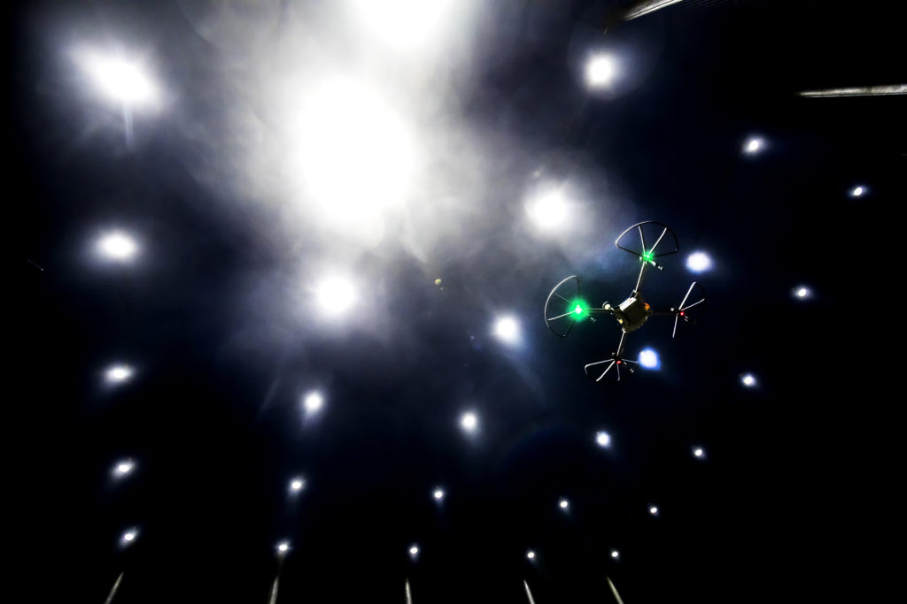

<figure>

<figcaption>

Autonomous aerial vehicles are flown at M-Air, an advanced robotics testing facility for air, sea, and land, on North Campus of the University of Michigan in Ann Arbor, MI. Photo: Joseph Xu

</figcaption>

</figure>

The University of Michigan is proud to be a partner in the pioneering [Center for Autonomous Air Mobility and Sensing](https://caams.center/) (CAAMS). This recognized National Science Foundation (NSF) [Industry-University Cooperative Research Center](https://iucrc.nsf.gov) (IUCRC), established in 2022, conducts cutting-edge research and training in autonomous air mobility and sensing technology.

"As a contributing member, the University of Michigan is enabling advancements at the forefront of research on autonomous aerospace vehicles and systems," said Dimitra Panagou, associate professor of robotics and aerospace engineering, and U-M's site director for CAAMS.

CAAMS is the only NSF-funded autonomous air mobility research center and is a collaboration of universities, including U-M, University of Colorado Boulder, Brigham Young University, Virginia Tech, Texas A&M, and Penn State.

CAAMS works with academia, industry, and government to drive innovative solutions to key technical challenges, provide high-level training for future industry leaders, and create collaborative research between faculty, industry partners, and government agencies.

Prominent areas of concentrated research include assured autonomy, AI/ML for aviation, unmanned aircraft systems, air mobility and air taxi systems, certification, testing, and evaluation, aerodynamics and design, robotics, and sensing applications.

One U-M research project done in coordination with CAAMS, “Enhancing the Agility of Tailsitter UAVs using Hybrid Data-Driven Aerodynamic Models,” is led by Derrick Yeo, lecturer in robotics, and Elena Shrestha, a postdoctoral associate. Their work aims to improve guidance and control techniques for multi-mode UAS during aggressive maneuvering beyond the envelope of conventional aircraft configurations by combining well-established aerodynamic principles with learning-based algorithms for inflight flowfield estimation.

Another CAAMS initiative at U-M is conducted by Carlos Cesnik, the Richard A. Auhll Department Chair of Aerospace Engineering. The project, “Real-time Simulation of Very Flexible Aircraft,” aims to develop computationally-efficient modeling and simulation for these aircraft.

Panagou is leading one of the CAAMS projects jointly with Brigham Young University, which addresses the safe and efficient planning and control for winged vertical take-off and landing (VTOL) aircraft. The project aims to develop novel techniques on constrained trajectory optimization and tracking control for flying autonomously in urban areas under safety and fuel constraints. 

In a different project, also in collaboration with Brigham Young University, Max Li, assistant professor of aerospace engineering collaborates with Yeo to enable architectures for the optimal management of fleets of unmanned aerial systems.

As a member of CAAMS, U-M receives benefits such as: access to ground-breaking research and intellectual property, direct recruitment opportunities with students receiving world-class training in air mobility and sensing, creation of valuable relationships, and access to partnership university resources, including research tools and facilities.
