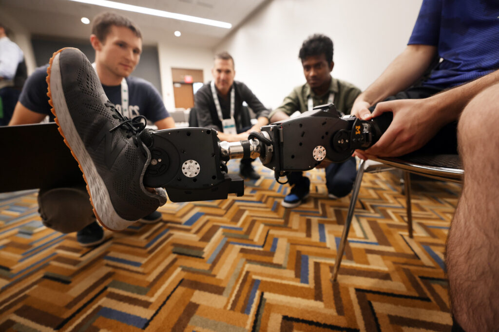

https://www.youtube.com/watch?v=xFliFk65l3Q

University of Michigan researchers received a $1M grant to develop and expand the ecosystem around the [Open-Source Leg](https://www.opensourceleg.org/about), a lower-limb robotic prosthesis [developed at U-M](https://news.engin.umich.edu/2019/06/open-source-bionic-leg-first-of-its-kind-platform-aims-to-rapidly-advance-prosthetics/). The device offers researchers standardized hardware and software for lower-limb prosthetics research, reducing the barriers to improving powered prosthetics and enabling their adoption.

“This grant is a key step toward engaging the wider research community–developing the infrastructure for an open-source project is challenging both to fund and create, and we’re very thankful for the continued NSF POSE award,” said [Elliott Rouse](https://robotics.umich.edu/profile/elliott-rouse/ "Elliott Rouse"), professor of robotics and mechanical engineering, and principal investigator on the grant.

The National Science Foundation (NSF) [Pathway to Enable Open-Source Ecosystems](https://new.nsf.gov/funding/initiatives/pathways-enable-open-source-ecosystems) (POSE) program, which awarded [the grant](https://www.nsf.gov/awardsearch/showAward?AWD_ID=2346117&HistoricalAwards=false), focuses on facilitating, creating, and growing open-source ecosystems out of open-source products. This includes building out sustainable governance, a cohesive community of developers, and a broad base of users.

<!--more-->

<figure>

<figcaption>

Professor Elliott Rouse, center, speaks with Kevin Best, left, a Robotics PhD, and Senthur Ayyappan, right, who works with Rouse on the Open-Source leg. The leg is being worn by first year Mechanical Engineering PhD student Andrew Seelhoff. Photo: Brenda Ahearn.

</figcaption>

</figure>

“The Open-Source Leg project has both hardware, in robotic leg design, and software, in control infrastructure, which makes it a very unique open-source project. As part of the POSE project, we’ve recently launched a new project website that showcases our approach to open source hardware and software,” added Rouse.

The Open-Source Leg project launched in 2019. The team focused on creating a “simple, low cost, and portable, yet high-performance” device, and shared the designs, parts list, and instructions on how to build the device online for other researchers to use. 

“The Open-Source Leg enables researchers to more easily study and compare different control strategies without the prohibitive cost of developing a robotic leg from scratch,” said Rouse.

Since its launch, the team has designed an updated version of the device, and also partnered with [Humotech](https://www.linkedin.com/company/human-motion-technologies-llc/) for those who would rather purchase a completed prosthesis with full service and support. Fifteen institutions from five different countries already use the device for research.

Following a POSE Phase I grant for the Open Source Leg, which funded initial planning and website development to strengthen user collaboration, the POSE Phase II grant will target the project’s scalability and sustainability. Using this grant, the team aims to build upon its tools and further establish a sustainable ecosystem. This includes fostering community engagement projects and events, enhancing the project’s digital infrastructure and deployment, and position the project for long-term success. 

“We are thrilled to begin our POSE Phase II efforts,” said Senthur Ayyapan, a research engineer in the Neurobionics Lab. 

“Our goal is for the Open-Source Leg project to address larger challenges across engineering, education, and open-source,” Ayyapan said. 

“Inspired by how the Linux Foundation democratized computing and sparked countless innovations, we want to democratize access to robotics research on a broader scale, fostering breakthroughs that can transform lives.”

Researchers interested in the Open-Source Leg can join the project community at [opensourceleg.org](http://opensourceleg.org/).
