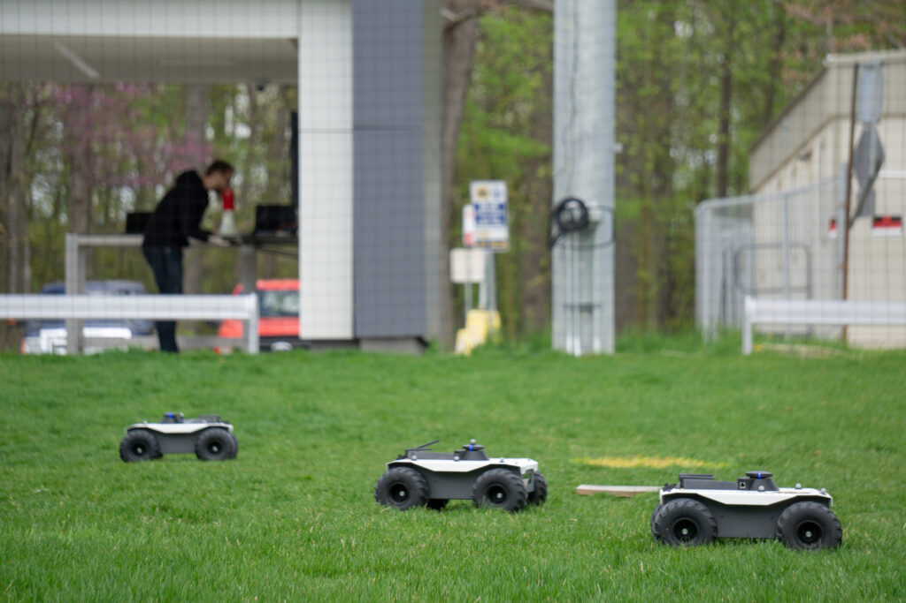

<figure>

<figcaption>

Members of Dimitra Panagou's lab test out a team of networked autonomous vehicles at M-Air.

</figcaption>

</figure>

[Dimitra Panagou](https://2024.robotics.umich.edu/profile/dimitra-panagou/ "Dimitra Panagou")’s research has the potential to create safe networked control systems across a vast number of fields, from aerial swarms to satellite constellations, connected vehicles, human-robot networks and beyond. Panagou, associate professor of robotics, has been recognized for these research efforts with the George J. Huebner, Jr. Research Excellence Award, which is given to those who have demonstrated sustained excellence in research and related scholarly activities. 

<!--more-->

Panagou’s notable work focuses on control systems for autonomous systems, including multi-agent autonomous systems such as spacecraft, aerial drones, and robotic systems. Her research has significant implications in the fields of control theory and practical applications, leading to safer and more reliable autonomous operations. Her work has uncovered key solutions to problems such as mitigating hacks of a swarm of autonomous vehicles, or accounting for the available energy or battery life of vehicles in a network, while still accomplishing their assigned task autonomously.

Panagou also leads as [U-M Site Director in the pioneering Center for Autonomous Air Mobility and Sensing](https://2024.robotics.umich.edu/2023/u-m-partners-with-autonomous-air-mobility-center/ "U-M partners with autonomous air mobility center") (CAAMS). This recognized National Science Foundation (NSF) Industry-University Cooperative Research Center (I-UCRC), established in 2022, conducts cutting-edge research and training in autonomous air mobility and sensing technology. CAAMS is the only NSF-funded autonomous air mobility research center and is a collaboration of universities.

Winning the award highlights Dr. Panagou's immense contributions to the Robotics Department, College of Engineering, and U-M's commitment to academic and research excellence.
