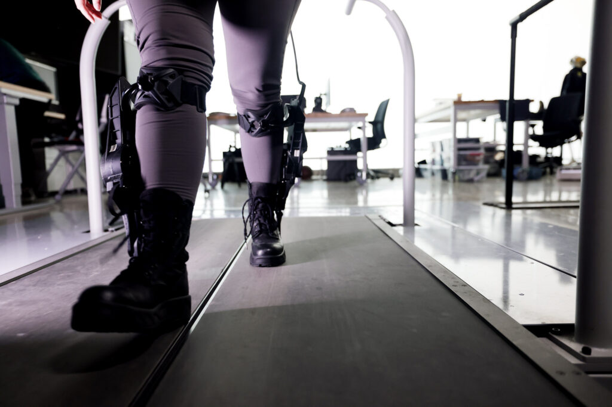

Researchers at North Carolina State University have demonstrated a new method that leverages artificial intelligence (AI) and computer simulations to train robotic exoskeletons to autonomously help users save energy for versatile activities such as walking, running, and climbing stairs. The work was done in collaboration with the University of Michigan and other institutions.

“This work proposes and demonstrates a new machine learning framework that bridges the gap between simulation and reality to autonomously control wearable robots to improve mobility and well being of humans,” says Hao Su, corresponding author of [a paper on this work published in the journal _Nature_](https://www.nature.com/articles/s41586-024-07382-4) and associate professor of mechanical and aerospace engineering at North Carolina State University

[Elliott Rouse](https://robotics.umich.edu/profile/elliott-rouse/ "Elliott Rouse"), associate professor of robotics and mechanical engineering at University of Michigan, is a co-author on the paper.

<!--more-->

https://www.youtube.com/watch?v=laiS5nbWShs

"This is a massive result for the field of wearable robotics,” says Rouse. “The sim-to-real tools–that have been responsible for many of the amazing demonstrations of robot bipeds and quadrupeds–have traditionally remained out of reach for the field of wearable robotics.”

“This new approach leverages physics-informed modeling of the human, robot, and attachment, enabling the system to learn how to assist across activities, even when a human user is present,” Rouse continues. “Not only was the team able to demonstrate sim-to-real transfer for wearable robots, but the developed controllers have the most impressive metabolic reductions in the literature. Now, we want to see these results replicated."

“Exoskeletons have enormous potential to improve human locomotive performance,” says Su. “However, their development and broad dissemination are limited by the requirement for lengthy human tests and handcrafted control laws.”

“The key idea here is that the embodied AI in a portable exoskeleton is learning how to help people walk, run, or climb in a computer simulation, without requiring any human experiments,” says Su.

Specifically, the researchers focused on improving autonomous control of embodied AI systems – which are systems where an AI program is integrated into a physical robot technology. This work focused on teaching robotic exoskeletons how to assist able-bodied people with various movements. Normally, users have to spend hours “training” an exoskeleton and wearing it throughout the experiments so that the technology knows how much force is needed – and when to apply that force – to help users walk, run, or climb stairs. The new method allows users to utilize the exoskeletons immediately.

“This work is essentially making science fiction reality – allowing people to burn less energy while conducting a variety of tasks,” says Su.

For example, in testing with human subjects, the researchers found that study participants used 24.3% less metabolic energy when walking in the robotic exoskeleton than without the exoskeleton. Participants used 13.1% less energy when running in the exoskeleton, and 15.4% less energy when climbing stairs.

“It’s important to note that these energy reductions are comparing the performance of the robotic exoskeleton to that of a user who is not wearing an exoskeleton,” Su says. “That means it’s a true measure of how much energy the exoskeleton saves.”

While this study focused on the researchers’ work with able-bodied people, the new method also applies to robotic exoskeleton applications aimed at helping people with mobility impairments.

“Our framework may offer a generalizable and scalable strategy for the rapid development and widespread adoption of a variety of assistive robots for both able-bodied and mobility-impaired individuals,” Su says.

“We are in the early stages of testing the new method’s performance in robotic exoskeletons being used by older adults and people with neurological conditions, such as cerebral palsy. And we are also interested in exploring how the method could improve the performance of robotic prosthetic devices for amputee populations.”

The paper, “Experiment-free Exoskeleton Assistance Via Learning in Simulation,” is published in the journal _Nature_. First author of the paper is Shuzhen Luo, a former postdoctoral researcher at NC State who is now an assistant professor at Embry-Riddle Aeronautical University. The paper was co-authored by Menghan Jiang, Junxi Zhu and Israel Dominguez Silva, who are Ph.D. students at NC State; Sainan Zhang and Shuangyue Yu, postdoctoral researchers at NC State; Tian Wang, a graduate student at NC State; Elliott Rouse of the University of Michigan; Bolei Zhou of the University of California, Los Angeles; Hyunwoo Yuk of the Korea Advanced Institute of Science and Technology; and Xianlian Zhou of the New Jersey Institute of Technology.

This research was done with support from the National Science Foundation under awards 1944655 and 2026622; the National Institute on Disability, Independent Living, and Rehabilitation Research (NIDILRR), under award 90DPGE0019, and  Switzer Research Fellowship SFGE22000372; and the National Institute of Health, under award 1R01EB035404.

[Original article by Matt Shipman from NCSU](https://news.ncsu.edu/2024/06/ai-training-robotic-exoskeletons/).
